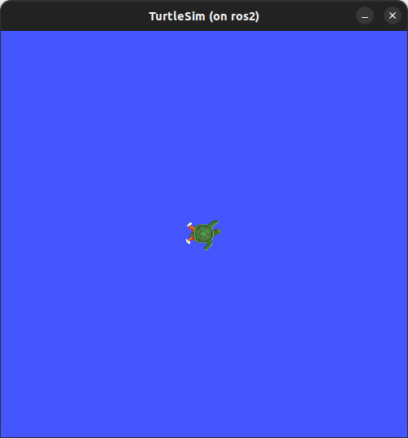

<div style="text-align: center">
    <h1>Setup</h1>
    <b>Polytech Angers</b> - Mobile Robotics
</div>

---

- [Docker memo](#docker-memo)
    - [Build and recover images](#build-and-recover-images)
    - [Basic commands](#basic-commands)
    - [The considered docker image](#the-considered-docker-image)
- [Running the image for the mobile robotic module](#running-the-image-for-the-mobile-robotic-module)
  - [The working directory](#the-working-directory)

---

# Docker memo

### Build and recover images

- Build an image from Dockerfile
```bash
docker build -t <imagename> .
```
This command should be done in the directory where the `Dockerfile` is (the `.` parameter indicates the current directory as working directory). The `-t` option is to provide a name to the image (a tag can be added as `<imagename>:<tagname>`)

- Save an image into a file

```bash
docker save -o <filename>.tar <imagename>:<imagetag>
```
The `-o` option is to set the output file name.

It can also be done calling `gzip` to compress the file
```bash
docker save <imagename>:<imagetag> | gzip > <filename>.tar.gz
```

- Load an image from a file

```bash
docker load -i /path/to/file.tar.gz
```
The `-i` is to provide the file path/name.


- Create a new `<targetimage>:<targettag>` that refers to `<sourceimage>:<sourcetag>`

```bash
docker image tag <sourceimage>:<sourcetag> <targetimage>:<targettag>
```

### Basic commands

- List all the current images

```bash
docker images
```
- Remove an image

```
docker rmi <imageID> -f
```
The ID of an image is displayed when listing the images (`docker images`). The `-f` option is to force the removal.

- List all the current containers

```bash
docker ps -a
```

The `-a` is to display even non-running containers (by default `ps` shows only running containers)

- Start a container (basic step)

```bash
docker run -it --rm --name <containername> <imagename>:<imagetag>
```
The option `-i` is of interactive (to keep STDIN open even if not attached), `-t` is to allocate a pseudo-TTY, `--rm` to automatically remove the container when it exits, `--name` to set a name to the container.

**Note : In the mobile robotic module we will use a run script to mount volumes and redirect display**

- remove a container
```bash
docker rm <name or id>
```
the name and the id of the containers are displayed with `docker ps -a`.

To remove all the existing containers:
```bash
docker ps --filter status=exited -q | xargs docker rm
```
`docker ps --filter status=exited -q` lists all the containers with the exited status (the `-q` option is to display only the id). `xargs` allows to execute the `docker rm` commands according to the standard input, here it is the result of the `docker ps` command.

Note that the same can be done for all the created containers: `docker ps --filter status=created -q | xargs docker rm`

- Attach a new terminal to a running container

To attach a new terminal to a running container, you can start a bash and attach it to a terminal. To do so, the following command can be used:

```bash
docker exec -it <name or id> bash
```
`exec` allows to execute a command in a running terminal, `-it` for interacted and tty options (to attach the result of the exec into the current terminal), the name and the id of the container can be display with `docker ps`, and `bash` to start a bash command prompt in the container.


### The considered docker image

- Based on Ubuntu 22.04
- `ros-humble-desktop` for ROS2
- `ignition-fortress` for Gazebo
- `ros-humble-ros-gz` and `ros-humble-ros-ign-bridge` for ROS/Gazebo bridge
- `python3-colcon-common-extensions` for Colcon

# Running the image for the mobile robotic module

You first need to load the image into your docker environment. The `docker images` command result should look like:
```bash
REPOSITORY   TAG              IMAGE ID       CREATED       SIZE
ros2         base             f69fadcf3ac3   5 hours ago   4.25GB
```
Note that the IMAGE ID and the CREATED time could differ...
If the image is not loaded, please proceed to the corresponding commands presented before.

## The working directory

From now, you have the image loaded in your docker environment. Your working directory should look like.
```bash
.
├── wdir [directory]
└── docker [directory]
    ├── run_linux_novnc.bash [file]
    ├── run_linux_x11.bash [file]
    ├── run_windows_novnc.ps1 [file]
    └── wdir [file]

```
In other world you should have the `run` file in a `docker` directory and a `wdir` directory next to it.

To start a docker container, connect it to a graphic server and mount the `wdir` volume, a `run` script is given:
- `run_linux_novnc.bash` : when using a linux host, this will use a novnc server for the graphic user interface
- `run_linux_x11.bash` : when using a linux host, to connect the container directly to the x11 server of the host
- `run_windows_novnc.ps1` : when using a windows host, this will use a novnc server for the graphic user interface

> Note: if your are on Linux you may want to the x11 script, the novnc configuration is a safety net when connecting to the x11 server does not work.

Once this is done you should have the following line on you prompt:

```bash
$ ./run_linux_x11.bash
[+] Running 1/1
 ⠿ Container ros2  Started 
```
From now, your container should be started and running. Just to make sure everything is fine, try the following command in a new prompt connected to your container (check the *attach a new prompt to a container* part of this document - or attach your vscode to the running container : `Open a Remote Window > Attach to running container > ros2`).

To check that ROS2 is set up properly you can run the command:
```
ros2 run turtlesim turtlesim_node
```
You should see a new window looking like (the turtle may differ):


