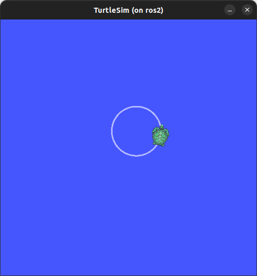

<div style="text-align: center">
    <h1>Introduction</h1>
    <b>Polytech Angers</b> - Mobile Robotics
</div>

---

- [Nodes](#nodes)
- [Topics](#topics)
- [Services](#services)
- [Parameters](#parameters)
- [Actions](#actions)

---

This introduction is widely inspired from https://docs.ros.org/en/foxy/Tutorials/Beginner-CLI-Tools.html

> The Robot Operating System (ROS) is a set of software libraries and tools for building robot applications. From drivers to state-of-the-art algorithms, and with powerful developer tools, ROS has what you need for your next robotics project. And it’s all open source.

> Since ROS was started in 2007, a lot has changed in the robotics and ROS community. The goal of the ROS 2 project is to adapt to these changes, leveraging what is great about ROS 1 and improving what isn’t.

ROS2 considers several notions: Nodes, Topics, Services, Actions, Parameters. Those are detailed in the latter. 

**To do all the following commands, you should run the ros2 image into docker with the provided run/docker compose file. From now, it is assumed that you are working in the ros2 container and that the `wdir` and the graphic user interface are set up correctly.**

## Nodes

> A node is a process (program) that performs computation.
http://wiki.ros.org/Nodes

> Each node in ROS should be responsible for a single, module purpose (e.g. one node for controlling wheel motors, one node for controlling a laser range-finder, etc). Each node can send and receive data to other nodes via topics, services, actions, or parameters.
https://docs.ros.org/en/humble/Tutorials/Beginner-CLI-Tools/Understanding-ROS2-Nodes/Understanding-ROS2-Nodes.html#

To list all the running node you can use the command
```bash
ros2 node list
```
At the beginning no node is running.

Start the `turtlesim_node` executable (a built-in demo for ROS2). This can be done with the command
```bash
ros2 run turtlesim turtlesim_node
```
- `ros2` : because it is a ros2 command...
- `run` : to run a node
- `turtlesim` : the package of the node to run
- `turtlesim_node` : the node to run

This should pop the TurtleSim window with the blue background and a random turtle at the center.


Start a new prompt in the docker container (if not in VS Code: `docker exec -it <id> bash`, with `docker ps` to display the ID of the running containers) and list the running nodes again:
```bash
ros2 node list
```
This time you should see the 
```bash
/turtlesim
``` 
node that has been started.

To display information about this node you can use the command
```bash
ros2 node info /turtlesim
```
You should have the following output:
```bash
/turtlesim
  Subscribers:
    /parameter_events: rcl_interfaces/msg/ParameterEvent
    /turtle1/cmd_vel: geometry_msgs/msg/Twist
  Publishers:
    /parameter_events: rcl_interfaces/msg/ParameterEvent
    /rosout: rcl_interfaces/msg/Log
    /turtle1/color_sensor: turtlesim/msg/Color
    /turtle1/pose: turtlesim/msg/Pose
  Service Servers:
    /clear: std_srvs/srv/Empty
    /kill: turtlesim/srv/Kill
    /reset: std_srvs/srv/Empty
    /spawn: turtlesim/srv/Spawn
    /turtle1/set_pen: turtlesim/srv/SetPen
    /turtle1/teleport_absolute: turtlesim/srv/TeleportAbsolute
    /turtle1/teleport_relative: turtlesim/srv/TeleportRelative
    /turtlesim/describe_parameters: rcl_interfaces/srv/DescribeParameters
    /turtlesim/get_parameter_types: rcl_interfaces/srv/GetParameterTypes
    /turtlesim/get_parameters: rcl_interfaces/srv/GetParameters
    /turtlesim/list_parameters: rcl_interfaces/srv/ListParameters
    /turtlesim/set_parameters: rcl_interfaces/srv/SetParameters
    /turtlesim/set_parameters_atomically: rcl_interfaces/srv/SetParametersAtomically
  Service Clients:

  Action Servers:
    /turtle1/rotate_absolute: turtlesim/action/RotateAbsolute
  Action Clients:
```

It displays the information regarding the node topics, services and actions. Those notions will be detailed in the latter.

## Topics

> Topics are named buses over which nodes exchange messages.
http://wiki.ros.org/Topics


https://docs.ros.org/en/humble/Tutorials/Beginner-CLI-Tools/Understanding-ROS2-Topics/Understanding-ROS2-Topics.html

After starting the `/turtlesim` node (check previous section), list all the current topics:

```
ros2 topic list
```

You should have the following output:

```
/parameter_events
/rosout
/turtle1/cmd_vel
/turtle1/color_sensor
/turtle1/pose
```

That corresponds to all the current topics. A topic is a bus where messages can be sent and received. The type of message that can go through the topic can be displayed with the `-t` option
```
docker@ros2:~/wdir$ ros2 topic list -t
/parameter_events [rcl_interfaces/msg/ParameterEvent]
/rosout [rcl_interfaces/msg/Log]
/turtle1/cmd_vel [geometry_msgs/msg/Twist]
/turtle1/color_sensor [turtlesim/msg/Color]
/turtle1/pose [turtlesim/msg/Pose]
```

The `/parameter_events` topic is to deal with parameters (detailed later) and the `/rosout` topic is the standard interface for log. Those two topics are basic topics that are always available (even when no node is running). Note that `rcl_interfaces` stands for `ros client library interfaces`.

All the other topics are from the `/turtlesim` node.

You can display information about a topic with the `topic info` command:

```
ros2 topic info /turtle1/pose
```
That should provide the corresponding output
```
Type: turtlesim/msg/Pose
Publisher count: 1
Subscription count: 0
```
The information displayed are the type of messages (interface), the number of publishers (nodes that send the messages) and subscribers (nodes that listen the messages).

For the `/turtle1/pose` topic, it can be seen that the messages that are going through this topic are `turtlesim/msg/Pose` type messages and that 1 node is publishing the messages.

To display information about the type of the messages, the command `interface show` can be used:
```
ros2 interface show turtlesim/msg/Pose
```
That shows the following information:
```
float32 x
float32 y
float32 theta

float32 linear_velocity
float32 angular_velocity
```
This says that a `turtlesim/msg/Pose` message is composed of 5 floats: x, y, theta, linear_velocity and angular_velocity.


To display the published messages, the `echo` command can be used
```
ros2 topic echo /turtle1/pose
```
This display the following output (`CTRL+C` to stop the command)
```
x: 5.544444561004639
y: 5.544444561004639
theta: 0.0
linear_velocity: 0.0
angular_velocity: 0.0
```
Those are the values of the messages published via the `/turtle1/pose` topic, there are the 5 floats we have seen earlier.

As it is possible to echo messages it is possible to publish them. Let check the `/turtle1/cmd_vel` topic:
```
docker@ros2:~/wdir$ ros2 topic info /turtle1/cmd_vel      
Type: geometry_msgs/msg/Twist
Publisher count: 0
Subscription count: 1
```
It is not published but, it is listened by a node. The type of the messages in this topic is `geometry_msgs/msg/Twist`. To display information about this type of messages (interface):

```
docker@ros2:~/wdir$ ros2 interface show geometry_msgs/msg/Twist
# This expresses velocity in free space broken into its linear and angular parts.

Vector3  linear
        float64 x
        float64 y
        float64 z
Vector3  angular
        float64 x
        float64 y
        float64 z
```

To publish a message via a topic, the `topic pub` command can be used:

```
ros2 topic pub --once /turtle1/cmd_vel geometry_msgs/msg/Twist "{linear: {x: 2.0, y: 0.0, z: 0.0}, angular: {x: 0.0, y: 0.0, z: 2.0}}"
```
The arguments of the command are:
- `--once` : an optional argument to publish this message only once
- `/turtle1/cmd_vel` : the name of the topic
- `geometry_msgs/msg/Twist` : the type of message (interface)
- `"{linear: {x: 2.0, y: 0.0, z: 0.0}, angular: {x: 0.0, y: 0.0, z: 1.0}}"`: the value of the message. This should be consistent with the interface of the message as shown before. The syntax correspond to a YAML abbreviated form.

> Note that you can use the **tab** autocompletion in the terminal prompt: to have a pre-fil data you can try entering `ros2 topic pub /turtle1/cmd_vel geometry_msgs/msg/Twist "li` and press tabulation key: this should provide the syntax of the data:
```
docker@ros2:~/wdir$ ros2 topic pub /turtle1/cmd_vel geometry_msgs/msg/Twist "linear:
  x: 0.0
  y: 0.0
  z: 0.0
angular:
  x: 0.0
  y: 0.0
  z: 0.0" 
  ```
> When using this approach you do not have the abbreviated YAML syntax (with the brackets) but the classical one.

This message is sent with the `pub` command, and as the `/turtlesim` node subscribed to this topic it receives the message and processes it, resulting moving the simulated robot:


To publish the message more than once, the `--rate` option can be used to define a publishing rate in Hz

```
ros2 topic pub --rate 1 /turtle1/cmd_vel geometry_msgs/msg/Twist "{linear: {x: 2.0, y: 0.0, z: 0.0}, angular: {x: 0.0, y: 0.0, z: 2.0}}"
```


To check if the message is correctly published, on a new prompt you can echo the `/turtle1/cmd_vel` topic to check if the messages are published:
```
docker@ros2:~/wdir$ ros2 topic echo /turtle1/cmd_vel 
linear:
  x: 2.0
  y: 0.0
  z: 0.0
angular:
  x: 0.0
  y: 0.0
  z: 2.0
```

To check if a message is published, you can also use the command `topic hz` that displays the publishing rate (in Hz) of messages via a topic:

```
docker@ros2:~/wdir$ ros2 topic hz /turtle1/cmd_vel
average rate: 1.000
        min: 1.000s max: 1.000s std dev: 0.00026s window: 3
```

## Services


> The publish / subscribe model is a very flexible communication paradigm, but its many-to-many one-way transport is not appropriate for RPC (Remote Procedure Call) request / reply interactions, which are often required in a distributed system. Request / reply is done via a Service, which is defined by a pair of messages: one for the request and one for the reply
http://wiki.ros.org/Services


https://docs.ros.org/en/humble/Tutorials/Beginner-CLI-Tools/Understanding-ROS2-Services/Understanding-ROS2-Services.html#

As for the topics, it is possible to list the services:

```
docker@ros2:~/wdir$ ros2 service list
/clear
/kill
/reset
/spawn
/turtle1/set_pen
/turtle1/teleport_absolute
/turtle1/teleport_relative
/turtlesim/describe_parameters
/turtlesim/get_parameter_types
/turtlesim/get_parameters
/turtlesim/list_parameters
/turtlesim/set_parameters
/turtlesim/set_parameters_atomically
```

You can notice that six services have `parameters` in their names. Nearly every node in ROS 2 has those infrastructure services that parameters are built on of (parameters are detailed later). The others are turtlesim specific services.

As for the topics, services have types:

```
docker@ros2:~/wdir$ ros2 service type /clear
std_srvs/srv/Empty
```
The `Empty` type is a standard type meaning that no data is sent/received.

To display information about a service type, the command `interface show` can be used (as for the topics):

```
docker@ros2:~/wdir$ ros2 interface show std_srvs/srv/Empty
---
docker@ros2:~/wdir$
```
In this case, we do not have any data in an `Empty` type. Let's test for another service:

```
docker@ros2:~/wdir$ ros2 service type /spawn 
turtlesim/srv/Spawn
docker@ros2:~/wdir$ ros2 interface show turtlesim/srv/Spawn
float32 x
float32 y
float32 theta
string name # Optional.  A unique name will be created and returned if this is empty
---
string name
```

The information above the `---` line tells us the arguments needed to call the service. In this case, `name` is an optional argument.

To call the service you can use the command `service call`

```
ros2 service call /spawn turtlesim/srv/Spawn "{x: 2, y: 2, theta: 0.2, name: ''}"
```

with the parameters:
- `/spawn` the service name
- `turtlesim/srv/Spawn` the service type (interface)
- `"{x: 2, y: 2, theta: 0.2, name: ''}"` the call value (must be consistent with the service type).

Doing the command also provide the service response:
```
docker@ros2:~/wdir$ ros2 service call /spawn turtlesim/srv/Spawn "{x: 2, y: 2, theta: 0.2, name: ''}"
requester: making request: turtlesim.srv.Spawn_Request(x=2.0, y=2.0, theta=0.2, name='')

response:
turtlesim.srv.Spawn_Response(name='turtle2')
```
Now you should have a new turtle in the TurtleSim window...


With this new turtle, new topics and services are available (you can check them with the previously explained commands). Note that there is still only one node.

Now you should be able to kill the new turtle. First check the `/kill` service type:
```
docker@ros2:~/wdir$ ros2 service type /kill
turtlesim/srv/Kill
docker@ros2:~/wdir$ ros2 interface show turtlesim/srv/Kill
string name
docker@ros2:~/wdir$ ros2 service call /kill turtlesim/srv/Kill "{name: 'turtle2'}"
requester: making request: turtlesim.srv.Kill_Request(name='turtle2')

response:
turtlesim.srv.Kill_Response()
```

## Parameters

> A parameter is a configuration value of a node. You can think of parameters as node settings. A node can store parameters as integers, floats, booleans, strings, and lists. In ROS 2, each node maintains its own parameters. 
https://docs.ros.org/en/humble/Tutorials/Beginner-CLI-Tools/Understanding-ROS2-Parameters/Understanding-ROS2-Parameters.html#

To list the parameters of the current node, you can use the `param list` command :

```
docker@ros2:~/wdir$ ros2 param list
/turtlesim:
  background_b
  background_g
  background_r
  qos_overrides./parameter_events.publisher.depth
  qos_overrides./parameter_events.publisher.durability
  qos_overrides./parameter_events.publisher.history
  qos_overrides./parameter_events.publisher.reliability
  use_sim_time
```

Every node has the parameter `use_sim_time` it’s not unique to turtlesim (it precises if the node should use the clock of the system or should listen to a clock topic - usually the case when using a simulator). The `qos_overrides` parameters (QoS: Quality of Service) are not detailed here.

Based on their names, it looks like `/turtlesim`’s parameters determine the background color of the turtlesim window using RGB color values.

To get the type and the current value of a parameter you can use the `param get` command
```
docker@ros2:~/wdir$ ros2 param get /turtlesim background_b
Integer value is: 255
```

To change the value of a parameter you can use the `param set` command
```
docker@ros2:~/wdir$ ros2 param set /turtlesim background_r 150
Set parameter successful
```
This should change the background color of the TurtleSim window.

## Actions

>Actions are one of the communication types in ROS 2 and are intended for long running tasks. They consist of three parts: a goal, feedback, and a result.

>Actions are built on topics and services. Their functionality is similar to services, except actions can be canceled. They also provide steady feedback, as opposed to services which return a single response.
https://docs.ros.org/en/humble/Tutorials/Beginner-CLI-Tools/Understanding-ROS2-Actions/Understanding-ROS2-Actions.html


As for the topics and service, you can list the current actions:

```
docker@ros2:~/wdir$ ros2 action list
/turtle1/rotate_absolute
```
You can also display information about an action:
```
docker@ros2:~/wdir$ ros2 action info /turtle1/rotate_absolute -t
Action: /turtle1/rotate_absolute
Action clients: 0
Action servers: 1
    /turtlesim [turtlesim/action/RotateAbsolute]
```
Note that the `-t` option is to display the types of the action. To display information about the action type:

```
docker@ros2:/home/wdir$ ros2 interface show turtlesim/action/RotateAbsolute
# The desired heading in radians
float32 theta
---
# The angular displacement in radians to the starting position
float32 delta
---
# The remaining rotation in radians
float32 remaining
```
The first section of this message, above the `---`, is the structure (data type and name) of the goal request. The next section is the structure of the result. The last section is the structure of the feedback.

To send a goal to an action, you can use the `action send_goal` command

```
ros2 action send_goal /turtle1/rotate_absolute turtlesim/action/RotateAbsolute "{theta: 1.57}"
```
with
- `/turtle1/rotate_absolute` the action name
- `turtlesim/action/RotateAbsolute` the action type
- `"{theta: 1.57}"` the action value (the goal)

This should output something like
```
docker@ros2:~/wdir$ ros2 action send_goal /turtle1/rotate_absolute turtlesim/action/RotateAbsolute "{theta: 1.57}"
Waiting for an action server to become available...
Sending goal:
     theta: 1.57

Goal accepted with ID: 0bdc5def00df406b928def2b17282678

Result:
    delta: -1.5360000133514404

Goal finished with status: SUCCEEDED
```

To see the feedback of this goal, add `--feedback` to the ros2 action `send_goal` command:

```
ros2 action send_goal /turtle1/rotate_absolute turtlesim/action/RotateAbsolute "{theta: -1.57}" --feedback
```

```
docker@ros2:~/wdir$ ros2 action send_goal /turtle1/rotate_absolute turtlesim/action/RotateAbsolute "{theta: -1.57}" --feedback
Waiting for an action server to become available...
Sending goal:
     theta: -1.57

Goal accepted with ID: 084b5e0681e1436bbaa8262a354b8bb4

Feedback:
    remaining: -3.124584913253784

[...]

Feedback:
    remaining: -0.004584908485412598

Result:
    delta: 3.119999885559082

Goal finished with status: SUCCEEDED
```