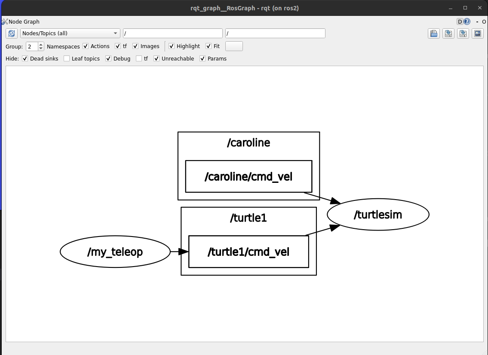
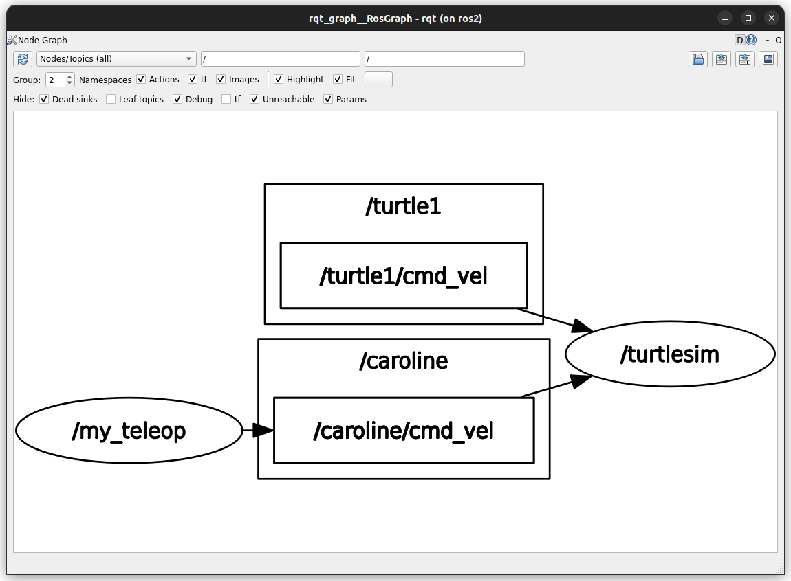

<div style="text-align: center">
    <h1>Launch file</h1>
    <b>Polytech Angers</b> - Mobile Robotics
</div>

---
- [Create a new turtle](#create-a-new-turtle)
  - [Remapping when starting the node](#remapping-when-starting-the-node)
- [Launch file](#launch-file)
  - [Clear](#clear)
---

# Create a new turtle

https://docs.ros.org/en/humble/Tutorials/Intermediate/Launch/Creating-Launch-Files.html

The `my_teleop` node ([TP1](1_3_ros2_tp1_teleop_turtle.md)) allows you to control a turtle from the `turtlesim` node with the keyboard.

Start the `turtlesim`:
```bash
docker@ros2:~/wdir$ ros2 run turtlesim turtlesim_node 
[INFO] [1680253857.266923780] [turtlesim]: Starting turtlesim with node name /turtlesim
[INFO] [1680253857.274311305] [turtlesim]: Spawning turtle [turtle1] at x=[5.544445], y=[5.544445], theta=[0.000000]
```

Add a new turtle:
```bash
docker@ros2:~/wdir$ ros2 service call /spawn turtlesim/srv/Spawn "{x: 2, y: 2, theta: 0.2, name: 'caroline'}"
requester: making request: turtlesim.srv.Spawn_Request(x=2.0, y=2.0, theta=0.2, name='caroline')

response:
turtlesim.srv.Spawn_Response(name='caroline')
```
Now check the available topics:
```bash
docker@ros2:~/wdir$ ros2 topic list
/caroline/cmd_vel
/caroline/color_sensor
/caroline/pose
/parameter_events
/rosout
/turtle1/cmd_vel
/turtle1/color_sensor
/turtle1/pose
```
There are the topics of the first turtle and the ones of the new turtle we added: `caroline`.

If we want to control the new turtle with the `my_teleop` node, we will face a problem: the node publishes a `/turtle1/cmd_vel` topic when the `caroline` turtle is listening a `/caroline/cmd_vel` topic... We could change the source code of the node, but one can see that this is not a consistent solution...

You can start a `my_teleop` node and check the topics.
With the `rqt_graph` tool you can visualize the topics and the interactions between the nodes:

```
rqt_graph
```
should display a window with the content:



The node  `/my_teleop` provides the command for the `/turtle1` but not for the turtle `/caroline`.

## Remapping when starting the node

One quick solution will be to remap the topic when starting the node (change the name). For instance:

```
docker@ros2:~/wdir$ ros2 run tp1 my_teleop.py --ros-args --remap /turtle1/cmd_vel:=/caroline/cmd_vel
```

will now provide the following "pipes"



This is handy when trying to test quickly a remapping but once you have several nodes to launch with several remapping and configuration to set, this is hard to handle it node by node...

To ease the starting and the configuring of several nodes, usually we use launch files.

# Launch file

https://docs.ros.org/en/humble/Tutorials/Intermediate/Launch/Creating-Launch-Files.html

> The launch system in ROS 2 is responsible for helping the user describe the configuration of their system and then execute it as described. The configuration of the system includes what programs to run, where to run them, what arguments to pass them, and ROS-specific conventions which make it easy to reuse components throughout the system by giving them each a different configuration.

> Launch files written in Python, XML, or YAML can start and stop different nodes as well as trigger and act on various events.

Create a `launch` directory into the `tp1` directory, and a `my_launch.py` file inside.
```bash
docker@ros2:~/wdir$ mkdir src/tp1/launch
docker@ros2:~/wdir$ touch src/tp1/launch/my_launch.py
```

**Note** You should have the following architecture:

```
tp1
├── launch
│   └── my_launch.py
├── package.xml
├── CMakeLists.txt
├── ...
└── src
    ├── ...
    └── my_teleop.py
```

Add the following content to the `my_launch.py` file

```py
# These import statements pull in some Python launch modules.
from launch import LaunchDescription
from launch_ros.actions import Node

# The launch description itself begins here:
def generate_launch_description():
    ld = LaunchDescription()

    # creating a node, from a package, with a given namespace
    turtle1 = Node( package='turtlesim',
                    namespace='turtlesim1',
                    executable='turtlesim_node',
                    name='sim1'
                    )
    # add the node as an action for our launch file
    ld.add_action(turtle1)

    return ld
```

To be able to start this launch file according to the package tp1, you need to modify the `package.xml` file adding the line 
```xml
<exec_depend>ros2launch</exec_depend>
```
after the `<buildtool_depend>` tags. This indicates that the package needs `ros2launch` when running.

And add the line 
```cmake
install(DIRECTORY launch DESTINATION share/${PROJECT_NAME})
```
into the `CMakeLists.txt` file, after the two `find_package()` lines.

Then rebuild the package.

You should now have in your `install` directory a new `launch` directory with the corresponding file:

```
docker@ros2:~/wdir$ ls -al install/tp1/share/tp1/launch/
total 16
drwxr-xr-x 4 docker docker 4096 Nov 21 16:05 .
drwxr-xr-x 6 docker docker 4096 Nov 21 16:04 ..
lrwxrwxrwx 1 docker docker   45 Nov 21 16:04 my_launch.py -> /home/docker/wdir/src/tp1/launch/my_launch.py
...
```
To start the launch file you can now use the command :
```bash
docker@ros2:~/wdir$ ros2 launch tp1 my_launch.py
```
This should start the `turtlesim_node`.

Let's try to start two nodes at once. Modify the `my_launch.py` file to add a new node to start:


```py
# These import statements pull in some Python launch modules.
from launch import LaunchDescription
from launch_ros.actions import Node

# The launch description itself begins here:
def generate_launch_description():
    ld = LaunchDescription()

    # creating a first node, from a package, with a given namespace
    turtle1 = Node( package='turtlesim',
                    namespace='turtlesim1',
                    executable='turtlesim_node',
                    name='sim1'
                    )

    # creating a second node, from a package, with a given namespace
    turtle2 = Node( package='turtlesim',
                    namespace='turtlesim2',
                    executable='turtlesim_node',
                    name='sim2'
                    )
    # add the two nodes as actions for the launch file
    ld.add_action(turtle1)
    ld.add_action(turtle2)
    return ld
```

If you did build the package with the `--symlink-install` option, you do not need to build the package again before running the launch file.

When running you should have two `turtle_sim` windows:
```bash
docker@ros2:~/wdir$ ros2 node list
/turtlesim1/sim1
/turtlesim2/sim2
docker@ros2:~/wdir$ ros2 topic list
/parameter_events
/rosout
/turtlesim1/turtle1/cmd_vel
/turtlesim1/turtle1/color_sensor
/turtlesim1/turtle1/pose
/turtlesim2/turtle1/cmd_vel
/turtlesim2/turtle1/color_sensor
/turtlesim2/turtle1/pose
```

OK, now we are able to start several nodes. This is not what we wanted when adding the `caroline` turtle, we wanted to call a service of a node that it is running. This can be done with the following launch code:

```py
# These import statements pull in some Python launch modules.
from launch import LaunchDescription
from launch_ros.actions import Node
from launch.substitutions import FindExecutable
from launch.actions import ExecuteProcess

# The launch description itself begins here:
def generate_launch_description():
    ld = LaunchDescription()
    
    # creating the node
    turtle_node = Node( package='turtlesim',
                        namespace='turtlesim1',
                        executable='turtlesim_node',
                        name='sim1'
                    )

    # creating a process to execute after starting the node
    ep = ExecuteProcess(
            cmd = [[
                FindExecutable(name="ros2"),
                " service call ",
                "/turtlesim1/spawn ",
                "turtlesim/srv/Spawn ",
                '"{x: 2, y: 2, theta: 0.2, name: \'caroline\'}"',
            ]],
            shell = True
        )
    # add the node
    ld.add_action(turtle_node)
    # add the process
    ld.add_action(ep)

    return ld
```

Now you should have one node and two turtles.
```bash
docker@ros2:~/wdir$ ros2 node list
/turtlesim1/sim1
docker@ros2:~/wdir$ ros2 topic list
/parameter_events
/rosout
/turtlesim1/caroline/cmd_vel
/turtlesim1/caroline/color_sensor
/turtlesim1/caroline/pose
/turtlesim1/turtle1/cmd_vel
/turtlesim1/turtle1/color_sensor
/turtlesim1/turtle1/pose
```

Let's update the launch file to also start the `my_teleop` node from the package `tp1`. You may face the following error:

