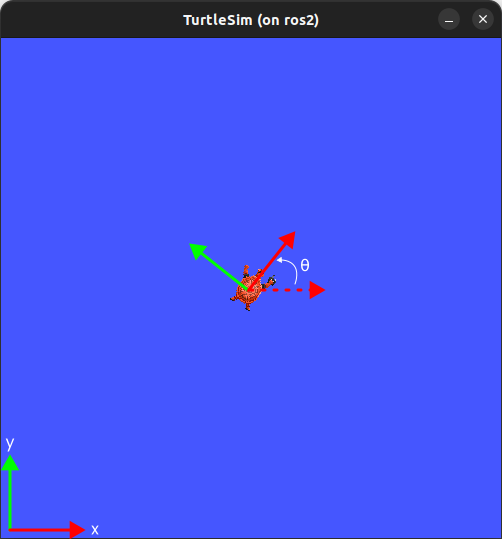

<div style="text-align: center">
    <h1>TP2 - Follow Path</h1>
    <b>Polytech Angers</b> - Mobile Robotics
</div>

---
- [Objectives](#objectives)
- [Dealing with multiple callbacks](#dealing-with-multiple-callbacks)
- [Advices/Tools](#advicestools)
- [Final](#final)
---

# Objectives

Create a new node named `follow_path.py` for the `tp1` package. The idea of this new node is to make the `turtlebot` following a given path. The path should be a `list` of `geometry_msgs/Point`.

This node should provide an action server with a `Path` interface:

```
docker@ros2:~/wdir$ ros2 action list -t
/path [tp1/action/Path]
/turtle1/rotate_absolute [turtlesim/action/RotateAbsolute]

docker@ros2:~/wdir$ ros2 action info /path
Action: /path
Action clients: 0
Action servers: 1
    /path_action_server

docker@ros2:~/wdir$ ros2 interface show tp1/action/Path 
geometry_msgs/Point[] path
        float64 x
        float64 y
        float64 z
---
geometry_msgs/Point final_point
        float64 x
        float64 y
        float64 z
---
geometry_msgs/Point reached_point
        float64 x
        float64 y
        float64 z
```

Each time the turtle reaches a point of the path, the node should provide feedback with the position of the turtle (may not be exactly the same as the point of the path due to floating errors, an error **lower than 0.1** for the distance between the robot and the point to reach is considered OK).


To help you here are the frames of the turtlesim :



Here is an expected output for the terminal that started the node:
```
docker@ros2:~/wdir$ ros2 run tp1 my_follow_path.py 
[INFO] [1679582924.119465386] [path_action_server]: Beginning path_action_server, shut down with CTRL-C
[INFO] [1679582926.587649566] [path_action_server]: Executing goal...
[INFO] [1679582963.612527235] [path_action_server]: ...Finished
```
And from the terminal that is sending a goal:
```
docker@ros2:~/wdir$ ros2 action send_goal /path tp1/action/Path "{path:[
{x: 5.0,y: 5.0,z: 0.0},
{x: 6.0,y: 5.0,z: 0.0},
{x: 7.0,y: 4.0,z: 0.0},
{x: 7.0,y: 2.0,z: 0.0},
{x: 6.0,y: 1.0,z: 0.0},
{x: 1.0,y: 1.0,z: 0.0},
{x: 1.0,y: 5.0,z: 0.0},
{x: 3.0,y: 5.0,z: 0.0},
{x: 5.0,y: 7.0,z: 0.0},
{x: 6.0,y: 7.0,z: 0.0},
{x: 5.0,y: 5.0,z: 0.0}]}" --feedback
Waiting for an action server to become available...
Sending goal:
     path:
- x: 5.0
  y: 5.0
  z: 0.0
- x: 6.0
  y: 5.0
  z: 0.0
- x: 7.0
  y: 4.0
  z: 0.0
- x: 7.0
  y: 2.0
  z: 0.0
- x: 6.0
  y: 1.0
  z: 0.0
- x: 1.0
  y: 1.0
  z: 0.0
- x: 1.0
  y: 5.0
  z: 0.0
- x: 3.0
  y: 5.0
  z: 0.0
- x: 5.0
  y: 7.0
  z: 0.0
- x: 6.0
  y: 7.0
  z: 0.0
- x: 5.0
  y: 5.0
  z: 0.0

Goal accepted with ID: a54594f44f1c4586a08f7613cee665bf

Feedback:
    reached_point:
  x: 5.214686393737793
  y: 5.059722423553467
  z: 0.0

Feedback:
    reached_point:
  x: 5.803219795227051
  y: 4.901607036590576
  z: 0.0

Feedback:
    reached_point:
  x: 6.938782215118408
  y: 4.212540149688721
  z: 0.0

Feedback:
    reached_point:
  x: 7.128311634063721
  y: 2.1667511463165283
  z: 0.0

Feedback:
    reached_point:
  x: 6.21790885925293
  y: 1.0316590070724487
  z: 0.0

Feedback:
    reached_point:
  x: 1.1945551633834839
  y: 0.9306159615516663
  z: 0.0

Feedback:
    reached_point:
  x: 0.9045485258102417
  y: 4.805110454559326
  z: 0.0

Feedback:
    reached_point:
  x: 2.8198211193084717
  y: 5.129850387573242
  z: 0.0

Feedback:
    reached_point:
  x: 4.966841220855713
  y: 6.798486232757568
  z: 0.0

Feedback:
    reached_point:
  x: 5.805067539215088
  y: 7.093291759490967
  z: 0.0

Feedback:
    reached_point:
  x: 4.865077495574951
  y: 4.822386741638184
  z: 0.0

Result:
    final_point:
  x: 4.865077495574951
  y: 4.822386741638184
  z: 0.0

Goal finished with status: SUCCEEDED
```

To write this node you can use the [ros2 documentation](https://docs.ros.org/en/foxy/Tutorials/Intermediate/Writing-an-Action-Server-Client/Py.html)

# Dealing with multiple callbacks

You will face the following issue: you may want to get the current pose of the robot while processing the action callback... But when in the action callback loop, other subscriber events are ignored.... Indeed, as the node is executed in a single thread, each blocking code prevent other callbacks to be processed... To avoid that you can run your node in several threads. In this objective, you can use the executor tool of ROS2.

> Execution management in ROS 2 is handled by Executors. An Executor uses one or more threads of the underlying operating system to invoke the callbacks of subscriptions, timers, service servers, action servers, etc. on incoming messages and events.
> https://docs.ros.org/en/iron/Concepts/Intermediate/About-Executors.html?highlight=executor

By affecting each callback in a different callback group, you should be able to process the callbacks at the same time

> When running a node in a Multi-Threaded Executor, ROS 2 offers callback groups as a tool for controlling the execution of different callbacks. 
> https://docs.ros.org/en/iron/How-To-Guides/Using-callback-groups.html?highlight=mutuallyexclusivecallbackgroup

Here is a test node code example with multithreaded executors and two callback groups (you can create a new `test.py` file and add it to your package).

```py
#!/bin/python3

import rclpy
from rclpy.node import Node
from rclpy.executors import MultiThreadedExecutor
from rclpy.callback_groups import MutuallyExclusiveCallbackGroup

from std_msgs.msg import String
import time

class MyTestNode(Node):
    
    subscription1: rclpy.subscription.Subscription
    subscription2: rclpy.subscription.Subscription

    def __init__(self):
        super().__init__('MyTestNode')

        # creation of the callback groups
        group1 = MutuallyExclusiveCallbackGroup()
        group2 = MutuallyExclusiveCallbackGroup()

        # two subscribers, each one affected to a callback group
        self.subscription1 = self.create_subscription( String,'myTopic1', self.listener_callback1, 1, callback_group=group1)
        self.subscription2 = self.create_subscription( String,'myTopic2', self.listener_callback2, 1, callback_group=group2)

    # callback for the first subscriber
    def listener_callback1(self, msg:String):
        self.get_logger().info(f'Callback 1: "{msg.data}"\nsleeping for 5s')
        time.sleep(5.0)
        self.get_logger().info(f'Callback 1: end!')

    # callback for the second subscriber
    def listener_callback2(self, msg:String):
        self.get_logger().info(f'Callback 2: "{msg.data}"\nsleeping for 5s')
        time.sleep(5.0)
        self.get_logger().info(f'Callback 2: end!')


def main(args=None):
    rclpy.init(args=args)
    my_node = MyTestNode()

    # declaration of the multithreaded executor
    executor = MultiThreadedExecutor()
    # adding the node to the executor
    executor.add_node(my_node)
    # spinning the executor
    executor.spin()

    rclpy.shutdown()


if __name__ == '__main__':
    main()
```

With that code you should have the following output:
```
TERMINAL 0
docker@ros2:~/wdir$ ros2 run tp1 test.py
[INFO] [1690288068.699960954] [MyTestNode]: Callback 1: "coucou 1"
sleeping for 5s
[INFO] [1690288069.566629546] [MyTestNode]: Callback 2: "coucou 2"
sleeping for 5s
[INFO] [1690288073.703502033] [MyTestNode]: Callback 1: end!
[INFO] [1690288074.571341808] [MyTestNode]: Callback 2: end!
```
```
TERMINAL 1
docker@ros2:~/wdir/src/tp1$ ros2 topic pub --once /myTopic1 std_msgs/msg/String "{data: coucou 1}"
publisher: beginning loop
publishing #1: std_msgs.msg.String(data='coucou 1')
```
```
TERMINAL 2
docker@ros2:~/wdir/src/tp1$ ros2 topic pub --once /myTopic2 std_msgs/msg/String "{data: coucou 2}"
publisher: beginning loop
publishing #1: std_msgs.msg.String(data='coucou 2')
```
It can be noticed that the callback 2 is done while waiting in the callback 1...


# Advices/Tools


- `print(dir(variable))` displays the members and functions of that variable
- `print(type(variable))` displays the type of a given variable
- Do it step by step, **validating each step**:
  - have a runnable node
  - run two callbacks at the same time
  - get the robot's pose
  - get action server running
  - loop over the points
  - for each point, move the robot to it
  - ...

By default, an action is reset when receiving a new goal. We do not want that behavior here : make sure that it is not possible to call the action callback twice, once the turtle start to follow the path it must finish it! To avoid resetting the action, one can test if a path is already being followed and if it is the case, use the `rclpy.action.server.ServerGoalHandle.abort()` function to send the `ABORTED` message to the client (before returning a dummy result).

# Final

Create the node `follow_path.py` and a launch file named `demo_launch.py` that starts: the turtlesim node, the follow_path node and that send the following action goal:
```
{
    path:[
        {x: 5.0,y: 5.0,z: 0.0},
        {x: 6.0,y: 5.0,z: 0.0},
        {x: 7.0,y: 4.0,z: 0.0},
        {x: 7.0,y: 2.0,z: 0.0},
        {x: 6.0,y: 1.0,z: 0.0},
        {x: 1.0,y: 1.0,z: 0.0},
        {x: 1.0,y: 5.0,z: 0.0},
        {x: 3.0,y: 5.0,z: 0.0},
        {x: 5.0,y: 7.0,z: 0.0},
        {x: 6.0,y: 7.0,z: 0.0},
        {x: 5.0,y: 5.0,z: 0.0}
    ]
}
```

