<div style="text-align: center">
    <h1>Simulating a robot</h1>
    <b>Polytech Angers</b> - Mobile Robotics
</div>

---
- [URDF file](#urdf-file)
  - [Set up the package](#set-up-the-package)
  - [Create a first "robot"](#create-a-first-robot)
  - [Move the robot](#move-the-robot)
- [Simulate the robot with Gazebo](#simulate-the-robot-with-gazebo)
  - [What is Gazebo ?](#what-is-gazebo-)
  - [Create your empty world](#create-your-empty-world)
  - [Add the robot to the simulation](#add-the-robot-to-the-simulation)
    - [Add it to the world](#add-it-to-the-world)
    - [Update the urdf](#update-the-urdf)
    - [Update the world](#update-the-world)
  - [Moving the robot](#moving-the-robot)
---

Turtlesim is nice, but now we want to simulate more accurately a robot: let's use gazebo.

When creating simulations/robot with ROS2/Gazebo you will encounter three types of xml files:
- [urdf](http://docs.ros.org/en/humble/Tutorials/Intermediate/URDF/URDF-Main.html) : Unified Robotics Description Format, URDF, is an XML specification used in academia and industry to model multibody systems such as robotic manipulator arms for manufacturing assembly lines and animatronic robots for amusement parks.
- [xacro](docs.ros.org/en/humble/Tutorials/Intermediate/URDF/Using-Xacro-to-Clean-Up-a-URDF-File.html) : Xacro (XML Macros) Xacro is an XML macro language. With xacro, you can construct shorter and more readable XML files by using macros that expand to larger XML expressions.
- [sdf](http://sdformat.org/) : SDFormat (Simulation Description Format), sometimes abbreviated as SDF, is an XML format that describes objects and environments for robot simulators, visualization, and control. Originally developed as part of the Gazebo robot simulator [...]. The Gazebo simulator will be presented later.

# URDF file

> URDF (Unified Robot Description Format) is a file format for specifying the geometry and organization of robots in ROS. 
> http://docs.ros.org/en/humble/Tutorials/Intermediate/URDF/URDF-Main.html?highlight=xacro

This part is widely inspired from http://docs.ros.org/en/humble/Tutorials/Intermediate/URDF/URDF-Main.html?highlight=xacro

## Set up the package

It is a good practice to have your robot/simulation description in a different package than your ROS2 nodes.

Let's create a new package named `tp3_description` inside a `tp3` directory. Inside that package we will not have any source code, but robot and simulation descriptions and launch files.  Create all the directory and files to have in your `wdir/src`:

```
[DIR] tp3
└── [DIR] tp3_description
    ├── [FILE] CMakeLists.txt
    ├── [DIR] gazebo
    ├── [DIR] launch
    ├── [FILE] package.xml
    ├── [DIR] rviz
    └── [DIR] urdf
```

Here is the content of the `CMakeLists.txt` file (we just create a package to access all the descriptions and launch files):

```cmake
cmake_minimum_required(VERSION 3.5)
project(tp3_description)  # The name of the package

find_package(ament_cmake REQUIRED)

install(DIRECTORY gazebo launch rviz urdf DESTINATION share/${PROJECT_NAME})

ament_package()
```

Here is the content of the `package.xml` file:

```xml
<?xml version="1.0"?>
<?xml-model href="http://download.ros.org/schema/package_format3.xsd" schematypens="http://www.w3.org/2001/XMLSchema"?>
<package format="3">
  <name>tp3_description</name> <!-- NAME OF THE PACKAGE -->
  <version>1.0.0</version>
  <description>Robots and simulation description for the TP3</description> <!-- DESCRIPTION OF THE PACKAGE-->
  <maintainer email="me@my.mail">My Name</maintainer> <!-- YOUR NAME AND MAIL -->
  <license>MIT</license> <!-- LICENSE FOR THE PACKAGE -->

  <buildtool_depend>ament_cmake</buildtool_depend>

  <export>
    <build_type>ament_cmake</build_type>
  </export>
</package>
```

## Create a first "robot"

Inside the urdf directory, create a new file named `tp3_robot.urdf`

Inside this file write the following code:
```xml
<?xml version="1.0"?>
<robot name="tp3_robot">
  <link name="base_link">
    <visual>
      <geometry>
        <cylinder length="0.6" radius="0.2"/>
      </geometry>
    </visual>
  </link>
</robot>
```

Here we create a robot named `tp3_robot` with one *link* (a rigid part of the robot). And we specify that this link looks like a cylinder of a given length and radius.

To visualize the robot, we can use `rviz2` which is a default visualization software provided with ROS2. 

To start rviz2 just use the command:
```
docker@ros2:~/wdir$ rviz2
```

You should have the following window:

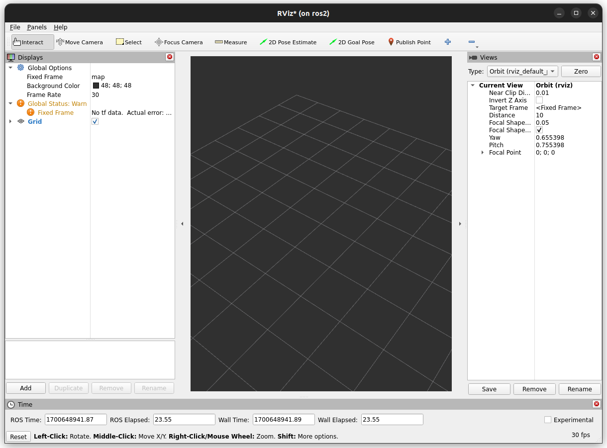

For now, we will just use it to visualize the urdf robot. To do that, click on the `Add` button (bottom left) and select RobotModel

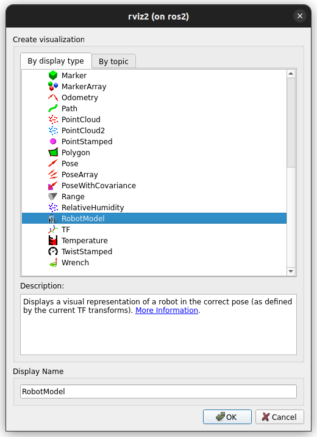

Nothing is displayed so far because by default rviz is looking for a ROS topic that provides the robot description. As we do not have any node providing that topic, we need to specify the file with the robot description. In `RobotModel > Description Source`, chose `File`, and in `RobotModel > Description File`, search for your urdf file.

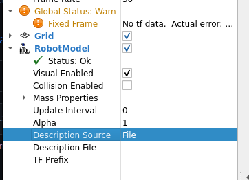

You then should have a white cylinder with an error status: `No transform from [base_link] to [map]`

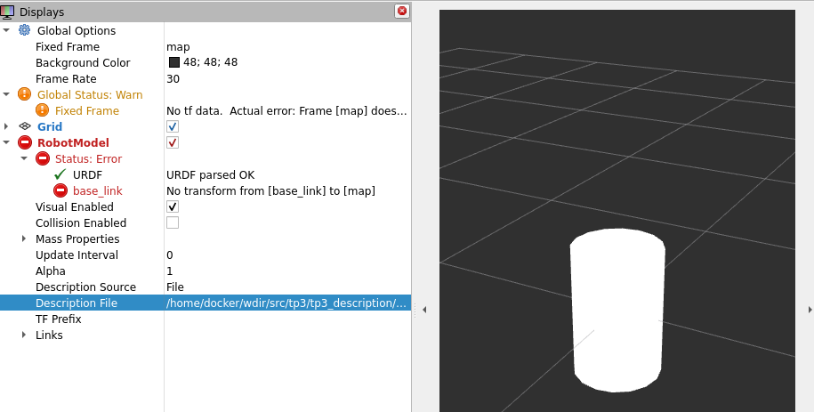

It means that the display is done in `map` frame (Global Options > Fixed Frame) but frame of the link of your robot is in a `base_link` frame. As no transform is published, rviz does not know the relation between those two frames...

You can bypass the error by changing the fixed frame to `base_link`.

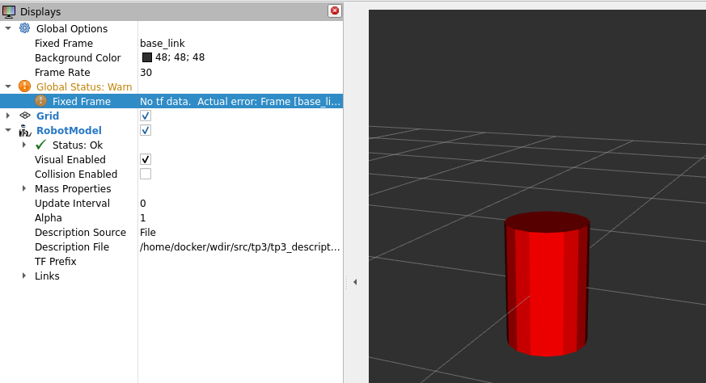

In order not to have to do this every time you want to check the urdf file, you can save the rviz configuration (`File > Save config as`) into the `rviz` directory of your `tp3_description` package.

```
tp3
└── tp3_description
    ├── CMakeLists.txt
    ├── gazebo
    ├── launch
    ├── package.xml
    ├── rviz
    │   └── base.rviz
    └── urdf
        ├── materials.urdf
        └── tp3_robot.urdf
```

This configuration can be loaded when starting rviz.

To ease the process, we can make a launch file that will start rviz with the right configuration...

Create a new file in the launch directory, named `base_rviz_launch.py` with the following content:

```py
# These import statements pull in some Python launch modules.
import os
from launch import LaunchDescription
from launch_ros.actions import Node
from launch_ros.substitutions import FindPackageShare

# The launch description itself begins here:
def generate_launch_description():
    ld = LaunchDescription()
    pkg_share = FindPackageShare(package='tp3_description').find('tp3_description')
    default_rviz_config_path = os.path.join(pkg_share, 'rviz/base.rviz')
    
    
    # Launch RViz
    start_rviz_cmd = Node(
        package='rviz2',
        executable='rviz2',
        name='rviz2',
        output='screen',
        arguments=['-d', default_rviz_config_path]
    )
    
    ld.add_action(start_rviz_cmd)

    return ld
```

Build the package, and now everything should start with the command

```
docker@ros2:~/wdir$ ros2 launch tp3_description base_rviz_launch.py 
```

Now, let's modify the urdf file to have a box as the body of the robot and add a left wheel to our robot (modify the `tp3_robot.urdf` file)

```xml
<?xml version="1.0"?>
<robot name="tp3_robot">
    
    <material name="blue">
        <color rgba="0.1 0.1 0.7 1.0"/>
    </material>
    <material name="red">
        <color rgba="0.7 0.1 0.1 1.0"/>
    </material>
    <material name="green">
        <color rgba="0.1 0.7 0.1 1.0"/>
    </material>
    <material name="yellow">
        <color rgba="0.7 0.7 0.1 1.0"/>
    </material>

    <link name="base_link">
        <visual>
            <geometry>
                <box size="2.0 1.0 0.5"/>
            </geometry>
            <material name = "blue"/>
        </visual>
    </link>

    <link name='left_wheel_link'>
        <visual name='visual'>
            <geometry>
                <cylinder radius="0.4" length="0.2"/>
            </geometry>
            <material name = "green"/>
        </visual>
    </link>

    <joint name="base_to_left_wheel_joint" type="fixed">
        <parent link="base_link"/>
        <child link="left_wheel_link"/>
        <origin xyz="-0.5 0.6 0" rpy="-1.5707 0 0"/>
    </joint>
</robot>
```

A new `link` has been added for the wheel, and also a `joint` to explicit the relation between those two links (`base_link` and `left_wheel_link`). 

But when trying to display the robot with rviz, we face a transform error again : `No transform from [left_wheel_link] to [base_link]`

This time we cannot change the Fixed Frame on rviz to solve it... This error raises because rviz needs tf2 transform between the two links to be able to display them, where the urdf file does not provide that...

An easy fix is to start a node that will publish the tf2 transform according to the joint on the urdf file. It already exists a node to do that : `robot_state_publisher` from the package with the same name.

Let's update the launch file to also start the `robot_state_publisher` node:

```py
# These import statements pull in some Python launch modules.
import os
from launch import LaunchDescription
from launch_ros.actions import Node
from launch_ros.substitutions import FindPackageShare
from launch.substitutions import Command

# The launch description itself begins here:
def generate_launch_description():
    ld = LaunchDescription()

    pkg_share = FindPackageShare(package='tp3_description').find('tp3_description')
    default_rviz_config_path = os.path.join(pkg_share, 'rviz/base.rviz')
    urdf_path = os.path.join(
        pkg_share,
       'urdf/tp3_robot.urdf'
    )

    start_rviz_cmd = Node(
        package='rviz2',
        executable='rviz2',
        name='rviz2',
        output='screen',
        arguments=['-d', default_rviz_config_path]
    )
    state_publisher_cmd = Node(
        package='robot_state_publisher',
        executable='robot_state_publisher',
        name='robot_state_publisher',
        output='screen',
        parameters=[{
            'robot_description': Command(["cat ", urdf_path]),
        }]
    )

    ld.add_action(start_rviz_cmd)
    ld.add_action(state_publisher_cmd)

    return ld
```

Now you should have your wheel at the correct position:

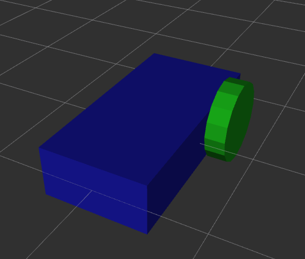

Do the same to add the right wheel (make it red), and finally add a castor wheel

```xml
    <link name='caster_wheel_link'>
        <visual name='visual'>
            <geometry>
                <sphere radius="0.2"/>
            </geometry>
            <material name = "yellow"/>
        </visual>
    </link>

    <joint name='base_to_caster_wheel_joint' type='fixed'>
        <parent link="base_link"/>
        <child link="caster_wheel_link"/>
        <origin xyz="0.8 0 -0.2" rpy="0 0 0"/>
    </joint>
```

You should have a robot looking like:

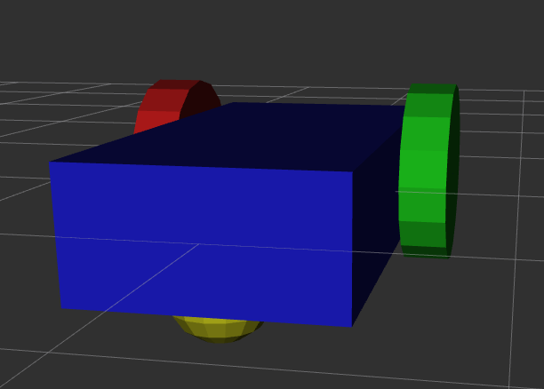

## Move the robot

To check the model of the robot, it is possible to move the joints. To do that, we can use the `joint_state_publisher_gui` tool.

Update your launch file to add the publisher node:

```py
joint_publisher_cmd = Node(
    package="joint_state_publisher_gui",
    executable="joint_state_publisher_gui",
    name="joint_state_publisher_gui",
)
```

When starting the launch file, you should have a new window named Joint State Publisher with two buttons `Randomize` and `Center`. But no joint is available...

The `joint_state_publisher_gui` is listening for the robot description (that is sent by the `robot_state_publisher`) and add sliders for each joint that can be modified.

That is, in the urdf file, all the joints are fixed! Update the left joint to add a continuous rotation :

```xml
<joint name="base_to_left_wheel_joint" type="continuous">
    <parent link="base_link"/>
    <child link="left_wheel_link"/>
    <axis xyz="0 0 1"/>
    <origin xyz="-0.5 0.6 0" rpy="-1.5707 0 0"/>
</joint>
```

When running the launch file again, you should have a slider to control the joint rotation:

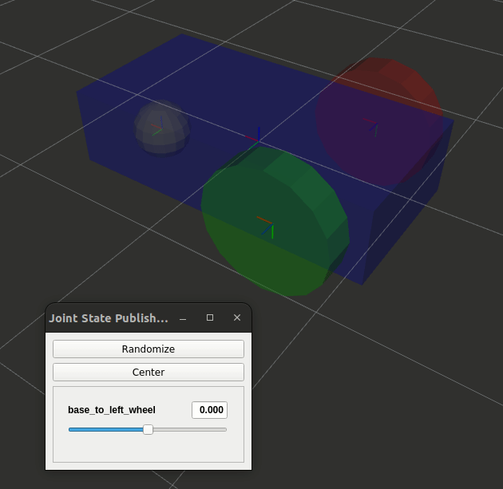

Add the rotation for the right wheel as well.

Now we have a robot that is ready to be controlled... But it is needed to simulate it first. **rviz is just a visualization tool, it does not simulate anything**.

# Simulate the robot with Gazebo

## What is Gazebo ?

> Gazebo is an open-source 3D robotics simulator. It integrated the ODE physics engine, OpenGL rendering, and support code for sensor simulation and actuator control.
> 
> Gazebo can use multiple high-performance physics engines, such as ODE, Bullet, etc. (the default is ODE). It provides realistic rendering of environments including high-quality lighting, shadows, and textures. It can model sensors that "see" the simulated environment, such as laser range finders, cameras (including wide-angle), Kinect style sensors, etc.
> https://en.wikipedia.org/wiki/Gazebo_simulator

You can check the installed version with the command

```
docker@ros2:~/wdir$ ign gazebo --version
Ignition Gazebo, version 6.15.0
Copyright (C) 2018 Open Source Robotics Foundation.
Released under the Apache 2.0 License.
```

There are two versions of Gazebo : `Gazebo classic` and `Gazebo sim`. The Gazebo classic ends with the gazebo v11(https://classic.gazebosim.org/), now it is recommended to use *new* `gazebo sim` instead. The recommended version to use with ROS2 `humble` is gazebo `Fortress` (https://gazebosim.org/docs/latest/ros_installation). This is the version we will use here.

Note that the `Ignition` named that appears with the new version of Gazebo will be abandoned (the `ign` command is replaced with a `gz` command in new Gazebo version, i.e. `Garden` and the `Harmonic` versions). But so far only `Fortress` is recommended with ROS2 so...

You can start gazebo on the docker image with the command

```
ign gazebo empty.sdf
```
you should have a default simulation screen:


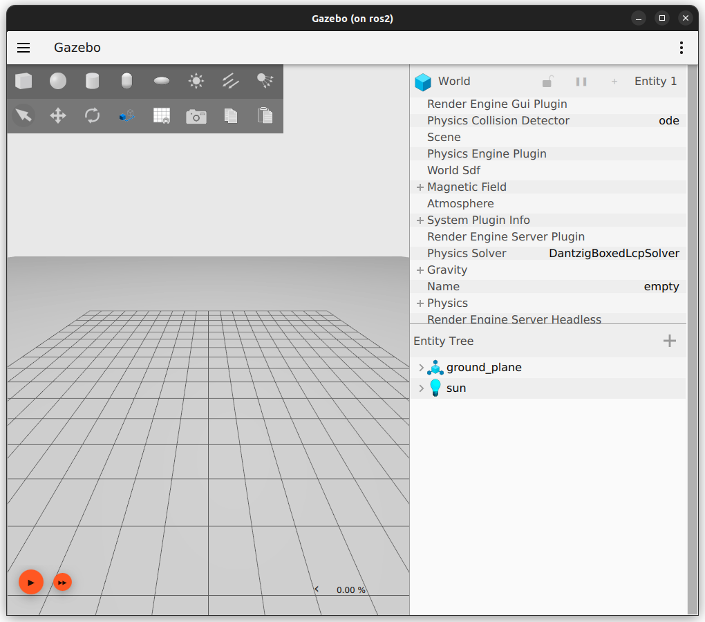

Gazebo supports SDF (Simulation Description Format) files:

> An SDF file defines the world environment, the robot's characteristics and what plugins to load.
> https://gazebosim.org/api/gazebo/3.7/migrationsdf.html


## Create your empty world

When starting gazebo earlier, we specified a `empty.sdf` world. But in the later we will want to add an environment, a robot... to our simulated world.

To be able to do that, let's create our empty world configuration file from which will be able to add stuff.

In the gazebo directory create a new file named `my_first_world.sdf` and add the following content :

```xml
<?xml version="1.0" ?>
<!-- sdf documentation : http://sdformat.org/spec?ver=1.9 
https://staging.gazebosim.org/docs/citadel/sdf_worlds 
https://gazebosim.org/docs/humble/building_robot
-->
<sdf version="1.9">
    <!-- The world element encapsulates an entire world description including models, scene, physics and plugins -->
    <world name="my_world">
        <!--Let's all the world elements to be default ones-->
    </world>
</sdf>
```

To run this empty world, and in order not to have to write the command line each time (with the relative path the `my_empty_world.sdf` configuration), let's create a new launch file named `base_gazebo_launch.py` in the launch directory. Write the following content in the launch file:

```py
from launch import LaunchDescription
from launch.substitutions import FindExecutable, PathJoinSubstitution
from launch_ros.substitutions import FindPackageShare
from launch.substitutions import FindExecutable
from launch.actions import ExecuteProcess

def generate_launch_description():
    
    gazebo_world_path = PathJoinSubstitution(
        [FindPackageShare('tp3_description'), 'gazebo', 'my_first_world.sdf']
    )

    gazebo_cmd = ExecuteProcess(
        cmd = [[
            FindExecutable(name="ign"),
            " gazebo ",
            gazebo_world_path,
        ]],
        shell = True
    )

    commands = [
        gazebo_cmd,
    ]

    return LaunchDescription(commands)
```

Compile the project to add the files into the `install` directory and start the launch file

```
ros2 launch tp3_description base_gazebo_launch.py
```

You should have the same screen as before (default empty world).

## Add the robot to the simulation

### Add it to the world

Now let's add our robot (urdf file) into this empty world. To do that, update your world (sdf file):

```xml
<world name="my_world">
    <include>
        <pose>0 0 1 0 0 0</pose><!--pose relative to the world-->
        <uri>model://urdf/tp3_robot.urdf</uri>
    </include>
</world>
```

When trying to run this new world, you should have the following error:

```
[Err] [Server.cc:139] Error Code 13: [/sdf/world[@name="my_world"]/include[0]/uri:/home/docker/wdir/install/tp3_description/share/tp3_description/gazebo/my_empty_world.sdf:L18]: Msg: Unable to find uri[model://urdf/tp3_robot.urdf]
```

Meaning that gazebo cannot find your urdf file... This is because `tp3_description` is a ROS2 package, and gazebo does not know about it... To link custom model, you can use the `IGN_GAZEBO_RESOURCE_PATH` environment variable. We could do it "by hand":
```
export IGN_GAZEBO_RESOURCE_PATH=/home/docker/wdir/install/tp3_description/share/tp3_description
```
but let's add it the launch file in order not to have to write the command each time we change the terminal... Update your python launch file:

```py
[...]
from launch.actions import SetEnvironmentVariable
[...]
    commands = [
        SetEnvironmentVariable(name='IGN_GAZEBO_RESOURCE_PATH', value=FindPackageShare('tp3_description')),
        gazebo_cmd,
    ]
[...]
```
Trying to run this new launch file, you should still have errors... The first one being:
```
Warning [parser_urdf.cc:2774] Error Code 18: Msg: urdf2sdf: link[base_link] is not modeled in sdf.[Err] [Server.cc:139] Error Code 16: Msg: A model must have at least one link.
```

It says that the link `base_link` is not modelled in the sdf file. This is because to simulate the dynamic of the robot, the visual information is not enough: you will need to add a collision and inertia information in your urdf...

### Update the urdf

For each link, you must add a `collision` tag : this is to specify the expected collision behavior in the simulation. For instance, you can have complex visual design with simple collision shapes: this leads to pretty and fast simulation.

In our case the `collision` tag will be the same as the `visual` one (as we only use simple shapes in our links, no meshes). For instance, for the `base_link` you should have:

```xml
    <link name="base_link">
        <visual>
            <geometry>
                <box size="2.0 1.0 0.5"/>
            </geometry>
            <material name = "blue"/>
        </visual>
        <collision>
            <geometry>
                <box size="2.0 1.0 0.5"/>
            </geometry>
        </collision>
    </link>
```

Add the collision tag to all the links.

To simulate the robot it is also needed `inertial` tags. To compute inertial matrices of simple shapes, you can use the functions available here (among other resources) https://gist.github.com/awesomebytes/39a4ba6c64956a1aa9bd

For instance, assuming that the weight of the robot's body is 1 kg, we have:
- ixx = 0.10416666666666666, ixy = 0, ixz = 0
- ixy = 0, iyy = 0.35416666666666663, iyz = 0
- ixz = 0, iyz = 0, izz = 0.41666666666666663

Some values are duplicated in the matrix, that leads to (for the `base_link` link):

```xml
    <inertial> <!--inertial properties of the link mass, inertia matix-->
        <mass value="1"/>
        <inertia ixx="0.10416666666666666" ixy="0" ixz="0" 
                    iyy="0.35416666666666663" iyz="0" 
                    izz="0.41666666666666663"/>
    </inertial>
```

For the left and right wheel (assuming they have a 0.5 kg weight) you should find:

```xml
    <inertial> 
        <mass value="0.5"/>
        <inertia ixx="0.02166666666666667" ixy="0" ixz="0" 
                    iyy="0.02166666666666667" iyz="0" 
                    izz="0.04000000000000001"/>
    </inertial>
```

and for the caster wheel as we do not want it to interact with the world, let's say that it does not have inertial coefficients :

```xml
<inertial> 
    <mass value="0"/>
    <inertia ixx="0.0" ixy="0" ixz="0" 
                iyy="0.0" iyz="0" 
                izz="0.0"/>
</inertial>
```

Updating your urdf, you should see your robot in the gazebo environment:

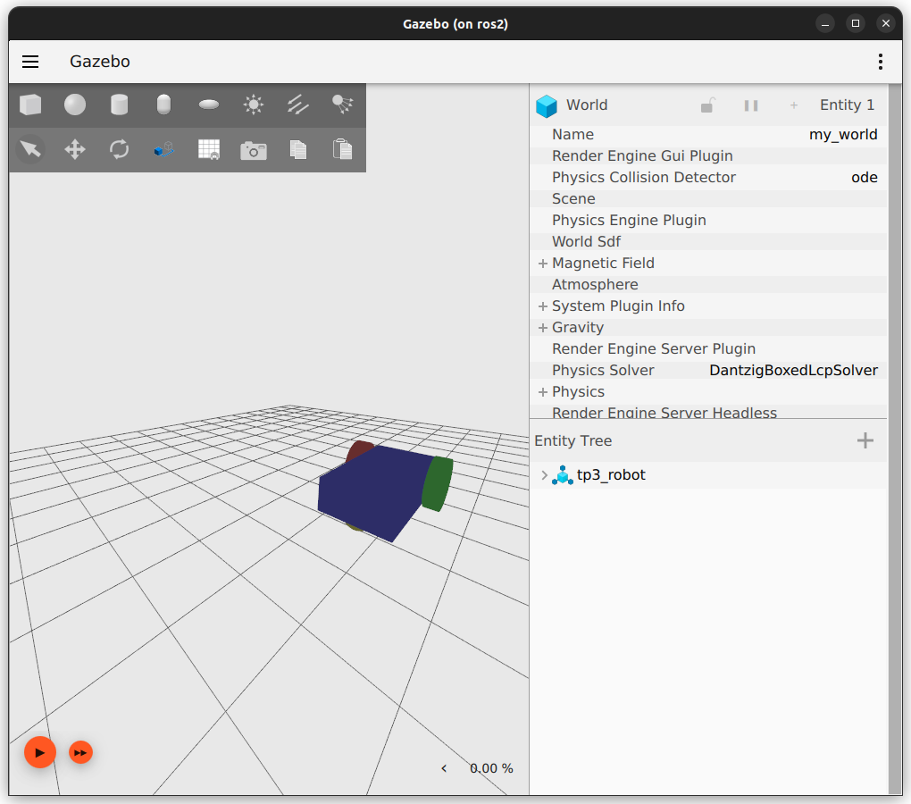

But if you start the simulation, your robot will fall.... There is no ground in your environment...

### Update the world

In the `my_first_world.sdf`, let's add a ground :

```xml
<!-- adding the ground plane -->
<model name="ground_plane">
    <!-- the ground will not move... -->
    <static>true</static>
    <!-- it is composed of only one link-->
    <link name="ground_plane_link">
        <!-- The collision shape of the link (can differ from the visual shape) -->
        <collision name="ground_plane_collision">
            <!-- the geometry of the collision  -->
            <geometry>
                <plane>
                    <!-- A ground plane  (x, y) -->
                    <normal>0 0 1</normal>
                </plane>
            </geometry>
        </collision>
        <!-- the visual aspect of the link -->
        <visual name="ground_plane_visual">
            <!-- the visual geometry of the link  -->
            <geometry>
                <plane>
                    <!-- A ground plane  (x, y) -->
                    <normal>0 0 1</normal>
                    <!-- with a 100x100 size (meters) -->
                    <size>100 100</size>
                </plane>
            </geometry>
            <material>
                <!-- To define the color of the ground with the light reflexion -->
                <ambient>0.68 0.96 0.52 1</ambient>
                <diffuse>0.68 0.96 0.52 1</diffuse>
                <specular>0.68 0.96 0.52 1</specular>
            </material>
        </visual>
    </link>
</model>
```

Now when running the simulation, the robot should fall to the ground and stay there.

To improve the simulation, we can also add a light (so far there is no shadow...). You can do it by adding in your world:

```xml
<light type="directional" name="sun">
    <!-- <pose> is the position (x,y,z) and orientation (roll, pitch, yaw)
    of the light element with respect to the frame mentioned in the relative_to attribute;
    in our case (relative_to attribute is ignored) it is relative to the world. -->
    <pose>0 0 10 0 0 0</pose>
    <!-- <cast_shadows> when true the light will cast shadows -->
    <cast_shadows>true</cast_shadows>
    <!-- <diffuse> and <specular> are the diffuse and specular light color -->
    <diffuse>0.8 0.8 0.8 1</diffuse>
    <specular>0.2 0.2 0.2 1</specular>
    <!-- <attenuation> specifies the light attenuation properties, which are: -->
    <attenuation>
        <!-- <range> is range of light. -->
        <range>1000</range>
        <!-- <constant> is the constant attenuation factor, 1 never attenuate and 0 complete attenuation -->
        <constant>0.9</constant>
        <!-- <linear> is the linear attenuation factor, 1 means attenuate evenly over the distance -->
        <linear>0.01</linear>
        <!-- <quadratic> is the quadratic attenuation factor. It adds curvature to the attenuation -->
        <quadratic>0.001</quadratic>
    </attenuation>
    <!-- <direction> is direction of the light, only applicable to spot and directional light -->
    <direction>-0.5 0.1 -0.9</direction>
</light>
```

You should now have the following simulation running:

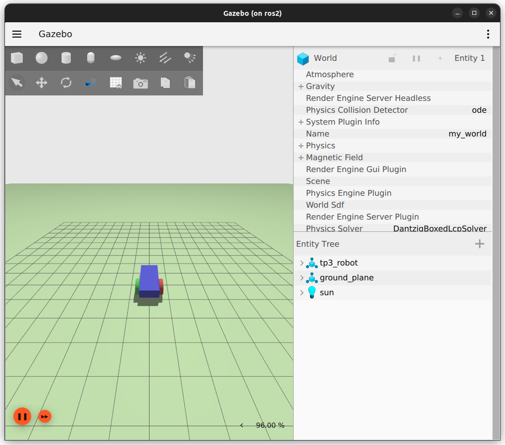


## Moving the robot

To be able to move the robot we will use the differential plugin provided with gazebo. 

https://en.wikipedia.org/wiki/Differential_wheeled_robot


Add it within the robot model. This is a gazebo plugin that you have to put in your urdf model.

```xml
<!-- The <plugin> tag has two attributes, filename which takes the library file name and name which takes the name of the plugin.
        In the <left_joint> and <right_joint> tags we define the joints which connect the left and the right wheel with the body of the robot, in our case base_to_left_wheel_joint and base_to_right_wheel_joint.
        <wheel_separation> takes the distance between the two wheels. Our robot has its left_wheel at 0.6 m and the right_wheel at -0.6 m in y-axis with respect to the chassis, so the wheel_separation is 1.2 m.
        <wheel_radius> takes the radius of the wheel which was defined in the <radius> tag under the wheel link.
        <odom_publish_frequency> sets the frequency at which the odometry is published at /model/vehicle_blue/odometry.
        cmd_vel is the input <topic> to the DiffDrive plugin -->
<gazebo>
    <plugin
        filename="libignition-gazebo-diff-drive-system.so"
        name="ignition::gazebo::systems::DiffDrive">
        <left_joint>base_to_left_wheel_joint</left_joint>
        <right_joint>base_to_right_wheel_joint</right_joint>
        <wheel_separation>1.2</wheel_separation>
        <wheel_radius>0.4</wheel_radius>
        <odom_publish_frequency>1</odom_publish_frequency>
        <topic>cmd_vel</topic>
    </plugin>
</gazebo>
```

From now, using ignition (gazebo) you should be able to move the robot. You can try the command (after running the simulation):
```
ign topic -t "/cmd_vel" -m ignition.msgs.Twist -p "linear: {x: 0.8}, angular: {z: 0.5}"
```
And the robot should move forward turning left. Congratulation, you have a running simulation of a differential wheeled robot!

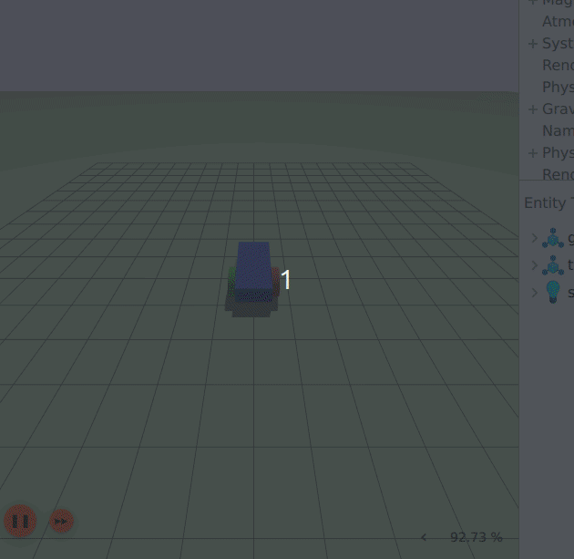