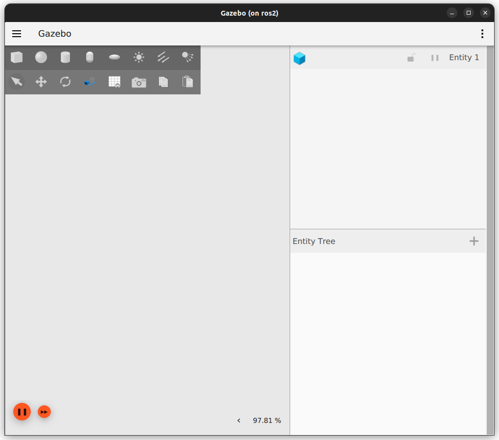

# Mobile Robotics

To be able to sense the environment, let's add a LiDAR sensor to the robot.

https://gazebosim.org/docs/fortress/sensors

## Adding a LiDAR sensor

### To the URDF

LiDAR is an acronym for "Light Detection And Ranging". This sensor can detect obstacles around the robot. We will use it to measure the distance between the robot (sensor) and the obstacles around the robot.
 
Let's add this sensor to the urdf file (in the `<robot>` tag). As it is gazebo that will simulate the sensor, the sensor has to be added in a `<gazebo>` tag:

```xml
<gazebo reference="base_link">
    <!-- The LiDAR sensor -->
    <sensor name='lidar' type='gpu_lidar'>"
        <!-- Pose of the LiDAR according to the base link -->
        <pose relative_to='base_link'>0 0 0.5 0 0 0</pose>
        <!-- Define the frame id for the LiDAR data (same as the robot's frame) -->
        <ignition_frame_id>base_link</ignition_frame_id>
        <!-- topic name for the LiDAR data -->
        <topic>lidar</topic>
        <!-- publishing rate of the data (in Hz) -->
        <update_rate>10</update_rate>
        <!-- ray configuration (360° plane LiDAR)-->
        <ray>
            <scan>
                <horizontal>
                    <samples>640</samples>
                    <resolution>1</resolution>
                    <min_angle>-3.14159</min_angle>
                    <max_angle>3.14159</max_angle>
                </horizontal>
                <vertical>
                    <samples>1</samples>
                    <resolution>0.01</resolution>
                    <min_angle>0</min_angle>
                    <max_angle>0</max_angle>
                </vertical>
            </scan>
            <range>
                <min>0.08</min>
                <max>10.0</max>
                <resolution>0.01</resolution>
            </range>
        </ray>
    </sensor>
</gazebo>
```

### To the SDF

Furthermore, for gazebo to be able to simulate your sensor, you need to add the sensor plugin (in the `sdf` file this time! At the beginning of the world)

```xml
<plugin
    filename="libignition-gazebo-sensors-system.so"
    name="ignition::gazebo::systems::Sensors">
    <render_engine>ogre2</render_engine>
</plugin>
```

Try running this simulation (with the `base_gazebo_launch.py` launch file for instance) will provide the following result:



It seems that adding the sensor plugin remove all the defaults ones... Let's add them "by hand":
- the plugin to show the scene:
```xml
<plugin filename="libignition-gazebo-scene-broadcaster-system.so" name="ignition::gazebo::systems::SceneBroadcaster">
    <!-- SceneBroadcaster shows our world scene -->
</plugin>
```
- the plugin to simulate all the physics
```xml
<plugin filename="libignition-gazebo-physics-system.so" name="ignition::gazebo::systems::Physics">
    <!-- The Physics plugin is very important for simulating the dynamics of the world. -->
</plugin>
```
Now your robot should be displayed and everything should run properly. How to check if the LiDAR data are published ? As it can be done with ROS2, with ignition it is possible to check the topics and echo them:
```
docker@ros2:~/wdir$ ign topic -l | grep lidar
/lidar
/lidar/points
```

To check that the plugin is working properly you can display the value of the /lidar data:
```
docker@ros2:~/wdir$ ign topic -e -t /lidar
```
the `-e` if for "echo" and the `-t` is for "topic". You should have data like:

```
ranges: inf
ranges: inf
ranges: inf
[...]
intensities: 0
intensities: 0
intensities: 0
[...]
ranges: inf
ranges: inf
ranges: inf
[...]
```

We do have sensor data, but there is no obstacle in the environment for the sensor to detect...

Let's add a wall in front of the robot in the `my_first_environment.sdf` file:

```xml
    <model name='wall'>
        <static>true</static>
        <pose>5 0 1 0 0 0</pose><!--pose relative to the world-->
        <link name='box'>
            <pose/>
            <visual name='visual'>
                <geometry>
                    <box>
                        <size>0.5 10.0 2.0</size>
                    </box>
                </geometry>
                <!--let's add color to our link-->
                <material>
                    <ambient>0.0 1.0 1.0 1</ambient>
                    <diffuse>0.0 1.0 1.0 1</diffuse>
                    <specular>0.0 1.0 1.0 1</specular>
                </material>
            </visual>
            <collision name='collision'>
                <geometry>
                    <box>
                        <size>0.5 10.0 2.0</size>
                    </box>
                </geometry>
            </collision>
        </link>
    </model>
```

Now you should have a wall in front of the robot and some range values:
```
[...]
ranges: 5.5916390419006348
ranges: 5.6311507225036621
ranges: 5.6511683464050293
ranges: 5.6917176246643066
ranges: 5.7329421043396
ranges: 5.7748255729675293
ranges: 5.8173542022705078
ranges: 5.8605146408081055
ranges: 5.904292106628418
ranges: 5.948674201965332
[...]
```
Note that all the `intensities` are always 0.

## Getting the data from ros2

To get the data from ros2, it is needed to add a new bridge between ign and ros2. First, let's get some information about the `/lidar` messages

```
docker@ros2:~/wdir$ ign topic -i -t /lidar
Publishers [Address, Message Type]:
  tcp://127.0.0.1:43255, ignition.msgs.LaserScan
```
`-i` for information and `-t` for the topic to have information of. For ros2, the laser scan messages are from `sensor_msgs` library:

```
docker@ros2:~/wdir$ ros2 run ros_gz_bridge parameter_bridge /lidar@sensor_msgs/msg/LaserScan[ignition.msgs.LaserScan
[INFO] [1680531781.743841320] [ros_gz_bridge]: Creating GZ->ROS Bridge: [/lidar (ignition.msgs.LaserScan) -> /lidar (sensor_msgs/msg/LaserScan)] (Lazy 0)
```

In another prompt you can check if the `/lidar` messages are available with ros2:

```
docker@ros2:~/wdir$ ros2 topic list
/lidar
/parameter_events
/rosout
```

## Display the LiDAR data with rviz2

Start rviz2.

In the rviz2 interface select the `Add` button to add a topic to display.

Using the new window, use the `By topic` tab to add the LiDAR data to rviz2.


You should have a frame error as encountered before. Change the base frame to `base_link` in order to display the LiDAR data.


## launch file

Create a new launch file named `teleop_rviz_gazebo_launch.py` that starts:
- The gazebo simulation;
- The teleop node to move the robot (from tp1 or from turtlesim);
- The bridges between ros2 and gazebo to control the robot and get the LiDAR data;
- rviz2 with a configuration that displays the robot and the LiDAR data (you can create a new configuration file named `lidar_gazebo.rviz` in the `rviz` directory);
- The nodes to be able to display the model of the robot in rviz.

Once starting the launch file you should have the following:

