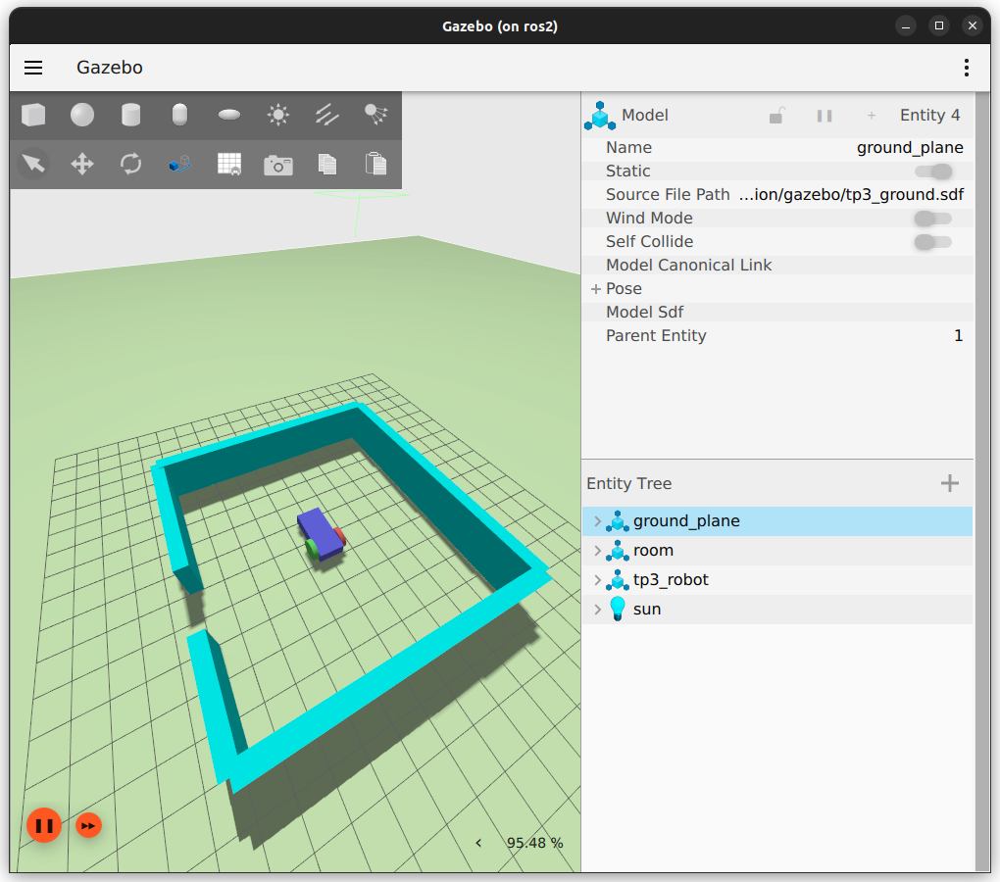
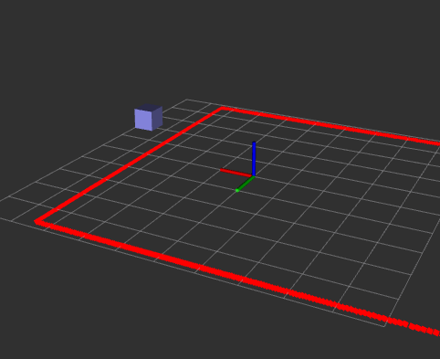
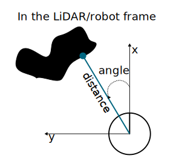
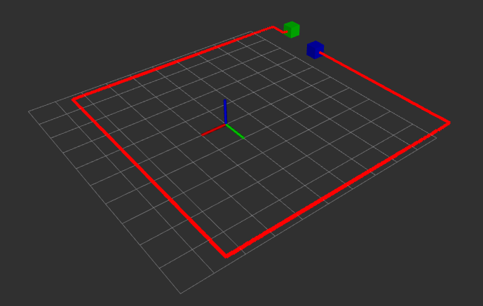
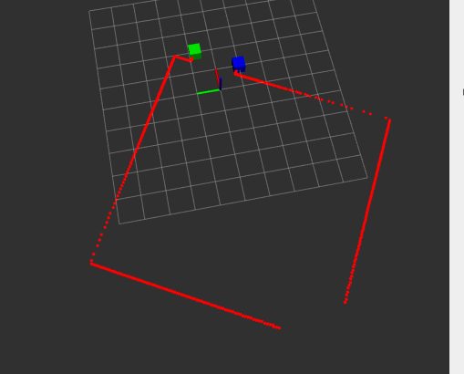
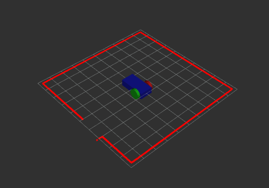

# Mobile Robotics - TP3 - Out of the room
- [Mobile Robotics - TP3 - Out of the room](#mobile-robotics---tp3---out-of-the-room)
  - [Organization of the gazebo directory](#organization-of-the-gazebo-directory)
  - [Create a room](#create-a-room)
  - [TP3](#tp3)
  - [Advices](#advices)
    - [launch files](#launch-files)
    - [Display markers on rviz](#display-markers-on-rviz)
    - [Process LiDAR data](#process-lidar-data)
    - [Steps that could be followed](#steps-that-could-be-followed)
      - [Locate the door](#locate-the-door)
      - [Consider several "states"](#consider-several-states)


## Organization of the gazebo directory

Before moving forward, let's reorganize the gazebo directory: instead of having all the models into one sdf file, let's put them in several files.

Create a new file named `tp3_ground.sdf` with the following content:

```xml
<?xml version='1.0'?>
<sdf version="1.9">
    <!-- adding the ground plane -->
    <model name="ground_plane">
        <!-- the ground will not move... -->
        <static>true</static>
        <!-- it is composed of only one link-->
        <link name="ground_plane_link">
            <!-- The collision shape of the link (can differ from the visual shape) -->
            <collision name="ground_plane_collision">
                <!-- the geometry of the collision  -->
                <geometry>
                    <plane>
                        <!-- A ground plane  (x, y) -->
                        <normal>0 0 1</normal>
                    </plane>
                </geometry>
            </collision>
            <!-- the visual aspect of the link -->
            <visual name="ground_plane_visual">
                <!-- the visual geometry of the link  -->
                <geometry>
                    <plane>
                        <!-- A ground plane  (x, y) -->
                        <normal>0 0 1</normal>
                        <!-- with a 100x100 size (meters) -->
                        <size>100 100</size>
                    </plane>
                </geometry>
                <material>
                    <!-- To define the color of the ground with the light reflexion -->
                    <ambient>0.68 0.96 0.52 1</ambient>
                    <diffuse>0.68 0.96 0.52 1</diffuse>
                    <specular>0.68 0.96 0.52 1</specular>
                </material>
            </visual>
        </link>
    </model>
</sdf>
```
a new file named `tp3_light.sdf` with the following content:
```xml
<?xml version='1.0'?>
<sdf version="1.9">
    <light type="directional" name="sun">
        <!-- <pose> is the position (x,y,z) and orientation (roll, pitch, yaw)
        of the light element with respect to the frame mentioned in the relative_to attribute;
        in our case (relative_to attribute is ignored) it is relative to the world. -->
        <pose>0 0 10 0 0 0</pose>
        <!-- <cast_shadows> when true the light will cast shadows -->
        <cast_shadows>true</cast_shadows>
        <!-- <diffuse> and <specular> are the diffuse and specular light color -->
        <diffuse>0.8 0.8 0.8 1</diffuse>
        <specular>0.2 0.2 0.2 1</specular>
        <!-- <attenuation> specifies the light attenuation properties, which are: -->
        <attenuation>
            <!-- <range> is range of light. -->
            <range>1000</range>
            <!-- <constant> is the constant attenuation factor, 1 never attenuate and 0 complete attenuation -->
            <constant>0.9</constant>
            <!-- <linear> is the linear attenuation factor, 1 means attenuate evenly over the distance -->
            <linear>0.01</linear>
            <!-- <quadratic> is the quadratic attenuation factor. It adds curvature to the attenuation -->
            <quadratic>0.001</quadratic>
        </attenuation>
        <!-- <direction> is direction of the light, only applicable to spot and directional light -->
        <direction>-0.5 0.1 -0.9</direction>
    </light>
</sdf>
```
a new file named `tp3_wall.sdf` with the following content:
```xml
<?xml version='1.0'?>
<sdf version="1.9">
    <model name='wall'>
        <static>true</static>
        <pose>5 0 1 0 0 0</pose><!--pose relative to the world-->
        <link name='box'>
            <pose/>
            <visual name='visual'>
                <geometry>
                    <box>
                        <size>0.5 10.0 2.0</size>
                    </box>
                </geometry>
                <!--let's add color to our link-->
                <material>
                    <ambient>0.0 1.0 1.0 1</ambient>
                    <diffuse>0.0 1.0 1.0 1</diffuse>
                    <specular>0.0 1.0 1.0 1</specular>
                </material>
            </visual>
            <collision name='collision'>
                <geometry>
                    <box>
                        <size>0.5 10.0 2.0</size>
                    </box>
                </geometry>
            </collision>
        </link>
    </model>
</sdf>
```

and finally a new file named `tp3_world.sdf` with the following content:
```xml
<?xml version="1.0" ?>
<sdf version="1.9">
    <!-- The world element encapsulates an entire world description including models, scene, physics and plugins -->
    <world name="my_world">
        <!-- The plugins for the simulation -->
        <plugin filename="libignition-gazebo-physics-system.so" name="ignition::gazebo::systems::Physics">
            <!-- The Physics plugin is very important for simulating the dynamics of the world. -->
        </plugin>
        <plugin filename="libignition-gazebo-scene-broadcaster-system.so" name="ignition::gazebo::systems::SceneBroadcaster">
            <!-- SceneBroadcaster shows our world scene -->
        </plugin>
        <plugin
            filename="libignition-gazebo-sensors-system.so"
            name="ignition::gazebo::systems::Sensors">
            <render_engine>ogre2</render_engine>
        </plugin>

        <!-- Add the light to the simulation -->
        <include>
            <uri>model://gazebo/tp3_light.sdf</uri>
        </include>

        <!-- Add the ground to the simulation -->
        <include>
            <uri>model://gazebo/tp3_ground.sdf</uri>
        </include>

        <!-- Add the wall to the simulation -->
        <include>
            <uri>model://gazebo/tp3_wall.sdf</uri>
        </include>

        <!-- Add the robot to the simulation -->
        <include>
            <pose>0 0 1 0 0 0</pose>
            <uri>model://urdf/tp3_robot.urdf</uri>
        </include>

    </world>
</sdf>
```

Create a new launch file named `tp3_description_launch.py` to test this new world file (the launch file should only start the gazebo simulation for now).

## Create a room

The advantage of that new organization is that it will be easier to update the simulation's environment. Let's create a random room using the following script (create a new file named `generate_room.py` in the `gazebo` directory, copy/paste the following code and run it).

```py
import random


def get_header():
    return """
<?xml version='1.0'?>
<sdf version="1.9">
    <model name='room'>
        <static>true</static>
"""

def get_footer():
    return """
    </model>
</sdf>
"""

def get_wall(name:str, pose:str, wall_length:float, wall_height:float):
    color = "0.0 1.0 1.0 1"
    wall_width = 0.5
    return f"""
            <link name='{name}'>
                <pose relative_to='__model__'>{pose}</pose>
                <visual name='visual'>
                    <geometry>
                        <box>
                            <size>{wall_width} {wall_length} {wall_height}</size>
                        </box>
                    </geometry>
                    <material>
                        <ambient>{color}</ambient>
                        <diffuse>{color}</diffuse>
                        <specular>{color}</specular>
                    </material>
                </visual>
                <collision name='collision'>
                    <geometry>
                        <box>
                            <size>{wall_width} {wall_length} {wall_height}</size>
                        </box>
                    </geometry>
                </collision>
            </link>
"""


def generate_room(sdffile_name:str):
    room_width = 10
    wall_height = 2
    door_size = 2

    poses:list
    names:list
    lengths:list
    with open(sdffile_name, "w") as room:
        room.write(get_header())

        door = random.randint(0,3)
        wall1_size = random.randint(1, room_width-door_size-1)
        wall2_size = room_width - wall1_size - door_size
        for side in range(4):
            match side:
                case 0:
                    if door != side:
                        poses = [f"{room_width/2} 0 {wall_height/2} 0 0 0"]
                        names = ["wNorth"]
                        lengths = [room_width]
                    else:
                        poses = [f"{room_width/2} -{room_width/2-wall1_size/2} {wall_height/2} 0 0 0", f"{room_width/2} {room_width/2-wall2_size/2} {wall_height/2} 0 0 0"]
                        names = ["wNorth1", "wNorth2"]
                        lengths = [wall1_size, wall2_size]
                case 1:
                    if door != side:
                        poses = [f"0 {room_width/2} {wall_height/2} 0 0 1.570796327"]
                        names = ["wWest"]
                        lengths = [room_width]
                    else:
                        poses = [f"-{room_width/2-wall1_size/2} {room_width/2} {wall_height/2} 0 0 1.570796327", f"{room_width/2-wall2_size/2} {room_width/2} {wall_height/2} 0 0 1.570796327"]
                        names = ["wWest1", "wWest2"]
                        lengths = [wall1_size, wall2_size]
                case 2:
                    if door != side:
                        poses = [f"-{room_width/2} 0 {wall_height/2} 0 0 0"]
                        names = ["wSouth"]
                        lengths = [room_width]
                    else:
                        poses = [f"-{room_width/2} -{room_width/2-wall1_size/2} {wall_height/2} 0 0 0", f"-{room_width/2} {room_width/2-wall2_size/2} {wall_height/2} 0 0 0"]
                        names = ["wSouth1", "wSouth2"]
                        lengths = [wall1_size, wall2_size]
                case 3:
                    if door != side:
                        poses = [f"0 -{room_width/2} {wall_height/2} 0 0 1.570796327"]
                        names = ["wEast"]
                        lengths = [room_width]
                    else:
                        poses = [f"-{room_width/2-wall1_size/2} -{room_width/2} {wall_height/2} 0 0 1.570796327", f"{room_width/2-wall2_size/2} -{room_width/2} {wall_height/2} 0 0 1.570796327"]
                        names = ["wEast1", "wEast2"]
                        lengths = [wall1_size, wall2_size]

            for (name, pose, length) in zip(names, poses, lengths):
                room.write(get_wall(pose=pose, name=name, wall_length=length, wall_height=wall_height))

        room.write(get_footer())


if __name__ == "__main__":
    sdffile_name = "tp3_room.sdf"
    generate_room(sdffile_name)
```

This code should create a `tp3_room.sdf` file in the `gazebo` directory. Update your `tp3_world.sdf` file to include the room model instead of the wall model. Running the simulation should provide something like:

```bash
docker@ros2:~/wdir$ ros2 launch tp3_description tp3_description_launch.py 
```



## TP3

Create a new package named `tp3_nodes` with a new node named `escape_room.py`.

The objective: when receiving a start message (`std_msgs/Bool` value over a `/tp3/start` topic) the robot should autonomously leave the room and stop when outside. Then the node publishes a finish message (`std_msgs/Bool` value over a `/tp3/finish` topic).

Here are the assumptions/rules for that exercise:
- At the beginning the robot is at the center of the room (all the walls are detected by the LiDAR sensor);
- The robot should stop if every part of it is out of the room;
- If the robot is already out of the room, the *start* command should not move the robot;

You should provide a launch file in the `tp3_nodes` package that starts everything.

## Advices

### launch files

You can create a launch directory in your `tp3_nodes` package and add a launch file named `tp3_nodes_launch.py`.

Inside this launch file you can call the gazebo launch file to start the simulation and the `escape_room.py` node. To call a launch file inside another launch file you can do:
```py
    description_dir = get_package_share_directory('tp3_description')
    launch_dir = os.path.join(description_dir, 'launch')
    
    gazebo_launch_cmd = IncludeLaunchDescription(
        PythonLaunchDescriptionSource(
            os.path.join(launch_dir, 'tp3_description_launch.py')
        ),
    )
```

Note that you can use the `-r` option when running gazebo in order to run the simulation at start (without having to press the *play* button). The `-s` option can be used when running gazebo to run it in headless mode and thus save some processing resources! I strongly recommend that you use those two options...

Your `tp3_nodes_launch.py` launch file should start:
- gazebo (with the simulation running and in headless mode);
- the bridges between gazebo and rviz;
- rviz with the LiDAR and the model of the robot displayed.

### Display markers on rviz

You may want to display some points on the rviz interface (to check your math for instance...). This can be done by publishing markers. You can create a publisher to publish marker values that can be displayed on rviz. For instance:

```py
from visualization_msgs.msg import Marker

[...]

self.pub_marker = self.create_publisher(Marker, '/tp3/debug_marker', 10)

[...]

marker = Marker()
# define the frame of the marker (needed to be displayed)
marker.header.frame_id = "base_link"
marker.header.stamp = self.get_clock().now().to_msg()

# Set the namespace and id for this marker.  This serves to create a unique ID
# Any marker sent with the same namespace and id will overwrite the old one
marker.ns = "basic_shapes"
marker.id = mid

# Set the marker type.  Initially this is CUBE, and cycles between that and SPHERE, ARROW, and CYLINDER
marker.type = Marker.CUBE

# Set the marker action.  Options are ADD and DELETE
marker.action = Marker.ADD

# Set the pose of the marker.  This is a full 6DOF pose relative to the frame/time specified in the header
marker.pose.position.x = point.x
marker.pose.position.y = point.y
marker.pose.position.z = 0.0
marker.pose.orientation.x = 0.0
marker.pose.orientation.y = 0.0
marker.pose.orientation.z = 0.0
marker.pose.orientation.w = 1.0

# Set the scale of the marker -- 1x1x1 here means 1m on a side
marker.scale.x = .5
marker.scale.y = .5
marker.scale.z = .5

# Set the color -- be sure to set alpha to something non-zero!
marker.color.r = red
marker.color.g = green
marker.color.b = blue
marker.color.a = 1.0

# marker.lifetime = 0

# Publish the marker
self.pub_marker.publish(marker)
```

A good starting point could be to send a marker when receiving the start message... Here is an example of display according to the previous code :



### Process LiDAR data

The LiDAR measurement corresponds to a distance according to an angle (from the x-axis of the sensor/robot). Here is a python code to get all the couple angle/distance of the measurements

```py
    def print_angle_dst(self, scan:LaserScan):
            angle = scan.angle_min
            for i, dst in enumerate(scan.ranges): # loop over all the LiDAR measurements
                if dst != float("inf"): # if the measurement detected an obstacle
                    self.get_logger().info(f"{angle=}, distance={scan.ranges[i-1]})")
                angle += scan.angle_increment
```
From that code you should be able to compute the x and y coordinates of the detected obstacles.




### Steps that could be followed

Once you are able to start everything with your launch file, and you are able to get the start message and display markers on rviz, you are fully set up! To code the node to autonomously step out of the room, here are some advice steps (you do not have to follow them if you do not want or if you have a better idea).

#### Locate the door

At first the robot should be at the center of the room. You also know the size of the door (check the python code that generated the room). You can use markers to check if you are able to identify the door correctly:




Be careful with the limited range of the sensor (every "hole" in the data set is not the door)...





#### Consider several "states"

You can use a state machine to solve this problem:
- first you need to place the robot in front of the door and orient in the direction of the door
- then the robot should move between the door
- finally the robot can move forward until it passes the door completely


Here is an example of expected results (on rviz):




